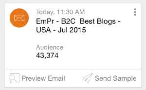

# 了解Marketo矩{#understanding-marketo-moments}

马克托的力量现在掌握在你手中，字面上！ 直接从手机或iPad预览并重新安排电子邮件。

>[!AVAILABILITY]
>
>
>需要“访问移动应用程序”权限。 联系您的营销人员管理员以[更新您的角色](/help/marketo/product-docs/administration/users-and-roles/managing-user-roles-and-permissions.md)。

## 流{#streams}

以下是“时刻”中的不同流。

>[!NOTE]
>
>**定义**
>
>* 瞬间：任何刚刚跑过或即将跑过的东西都在这里。
>* 收藏夹：你最喜欢的东西都放在这里。
>* 稍后：比这一刻更晚发生的一切都会在这里发生。
>* 完成：完成运行或标记为“完成”的任何内容都将在此处处理。

好，既然我们已经解决了这个问题，让我们在手机上看一下Marketo Moments!

## 三种卡{#three-kinds-of-cards}

Marketo Moments为您提供了三张不同的卡片，用于跟踪电子邮件的进度：

**现场** -此邮件即将发布。这是您预览、发送样本或者取消它（如果需要）的最后机会。

**心跳** -嘿——这封邮件正在发送！还有统计数据。 继续分享。

**结果** -以下是电子邮件的操作方式。电子邮件运行完毕后，结果卡将显示参与分数和其他统计数据。

## 矩流{#moments-stream}

首次打开应用程序或点按菜单中的&#x200B;**矩**&#x200B;时，相关卡会首先显示。 每个计划都包含有关该特定营销计划及其整体表现的信息。

点击卡可打开详细信息屏幕。

>[!NOTE]
>
>橙色卡被确认；灰色的是试探性的。

点击三个点可打开卡操作菜单。

太好了！ 现在，您可以通过点击：

>[!NOTE]
>
>**定义**
>
>* 收藏夹：如果您喜欢最及时、最重要的内容，您就可以轻松地加以关注。
>* 完成：Done可从Marketo Moments视图中删除它（但将它保留在Marketo中，安全、可靠）。
>* 共享：发送图像以激励您的团队或向其表示祝贺。
>* 发送示例（仅限电子邮件）:在您发送电子邮件之前，使用此组件让其他人查看电子邮件的外观。
>* 预览电子邮件（仅限电子邮件）:提前查看电子邮件总是个好主意。

## 后期时刻{#later-moments}

“稍后”部分显示即将到来的活动。

1. 开始。

   

1. 点按&#x200B;**稍后**。

   

   查看即将推出的列表活动。

   

## 电子邮件项目卡{#email-program-cards}

电子邮件项目卡显示重要内容，如计划、受众、状态和其他有用信息，即使您在午餐时外出。

## 事件卡{#event-cards}

对于事件，您将看到成员总数及其状态。

## 分析卡{#analytics-cards}

分析时刻卡向您显示您的电子邮件和事件在过去六个月中的按月表现，具体包括：

1. 获得的潜在客户
1. 新潜在客户
1. 取消订阅

## 智能活动运行卡{#smart-campaign-run-cards}

智能活动卡表示单个活动运行。 每次智能活动运行时都会显示新卡。 点击查看使用的智能列表过滤器、活动流以及活动中使用的每封电子邮件。

## 确认或取消操作{#confirm-or-cancel-an-action}

每一步，您都可以确认或取消操作。 如果您改变了主意，只需点按&#x200B;**Never Mind**。

## 支持的版本{#supported-versions}

Marketo Moments支持以下操作系统版本：

* Apple iOS 8.0及更高版本。
* Android版本4.1及更高版本（基本上是Jellybean和更高版本）。

准备好了解更多信息？

>[!MORELIKETHIS]
>
>* [了解电子邮件项目卡](/help/marketo/product-docs/core-marketo-concepts/mobile-apps/marketo-moments/understanding-moments/understanding-email-program-cards.md)
>* [了解事件卡](/help/marketo/product-docs/core-marketo-concepts/mobile-apps/marketo-moments/understanding-moments/understanding-event-cards.md)
>* [了解分析卡](/help/marketo/product-docs/core-marketo-concepts/mobile-apps/marketo-moments/understanding-moments/understanding-analytics-cards.md)
>* [了解智能活动卡](/help/marketo/product-docs/core-marketo-concepts/mobile-apps/marketo-moments/understanding-moments/understanding-smart-campaign-cards.md)

