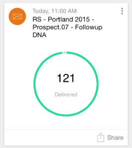

# 了解Marketo时刻 {#understanding-marketo-moments}

Marketo的力量现在掌握在你的手中，真的！ 直接从您的手机或iPad预览和重新计划电子邮件。

>[!NOTE]
>
>需要访问“移动设备应用程序”权限。 联系Marketo管理员以 [更新您的角色](/help/marketo/product-docs/administration/users-and-roles/managing-user-roles-and-permissions.md).

>[!AVAILABILITY]
>
>此应用程序与不兼容 [Adobe身份验证](/help/marketo/product-docs/administration/marketo-with-adobe-identity/adobe-identity-management-overview.md){target="_blank"} 此时。

## 流 {#streams}

以下是《时刻》中的不同串流。

>[!NOTE]
>
>**条件**
>
>* 时刻：刚刚运行或即将运行的任何内容都将在此处显示。
>* 收藏夹：您制作收藏夹的任何内容都将放在此处。
>* 稍后：此处显示晚于此时间发生的任何事件。
>* 完成：此处放置所有已完成运行或您标记为完成的内容。

好的，现在我们已解决了这个问题，让我们在电话上查看Marketo时刻！

## 三类卡 {#three-kinds-of-cards}

Marketo时刻会为您提供三种不同的信息卡，以跟踪电子邮件的进度：

**板载**  — 此电子邮件即将发出。 这是您预览它的最后机会，您可以发送样本，如果必要，甚至可以取消它。

**心率**  — 嘿 — 此电子邮件正在发送！ 这里还有统计数据。 继续分享吧。

**结果**  — 以下是电子邮件的用途。 电子邮件运行完成后，结果卡显示参与度分数和其他统计信息。

## 矩流 {#moments-stream}

首次打开应用程序或点按时 **矩** 在菜单中，首先显示相关卡片。 每个报表包都包含有关该特定营销计划及其整体绩效的信息。

点按卡片会打开详细信息屏幕。

>[!NOTE]
>
>橙色卡片已确认；灰色卡片已试用。

点按三个圆点会打开卡片操作菜单。

太棒了！ 现在，您可以通过点按来让事情发生：

>[!NOTE]
>
>**条件**
>
>* 收藏：如果您将最及时、最重要的内容设为收藏，则很容易引起人们的注意。
>* 已完成：完成操作可使其从您的Marketo时间视图中脱离(但可将其保留在Marketo中，安全无虞)。
>* 共享：发送图像以激励或祝贺您的团队。
>* 发送示例（仅限电子邮件）：使用此功能让其他人在您发送电子邮件之前查看您的电子邮件的外观。
>* 预览电子邮件（仅限电子邮件）：最好提前查看电子邮件。

## 后续时刻 {#later-moments}

后面部分显示即将推出的活动。

1. 首先点一下汉堡菜单。

   

1. 点按 **稍后**.

   

   查看即将开展的活动列表。

   

## 以电子邮件发送程序卡 {#email-program-cards}

电子邮件程序卡会显示重要信息，如日程安排、受众、状态和其他有用信息，即使您午餐时也可以看到。

## 活动卡片 {#event-cards}

对于事件，您将看到成员总数及其状态。

## Analytics卡片 {#analytics-cards}

Analytics时刻卡片会向您展示过去六个月电子邮件和事件的每月执行情况，例如：

1. 已获得的潜在客户
1. 新潜在客户
1. 取消订阅

## 智能营销活动运行卡 {#smart-campaign-run-cards}

智能营销活动卡表示营销活动的一次运行。 每次运行智能营销活动时，都会显示一个新信息卡。 点击以查看使用的智能列表过滤器、营销活动流量以及营销活动中使用的每个电子邮件。

## 确认或取消操作 {#confirm-or-cancel-an-action}

每走一步，您都可以确认或取消操作。 如果你改变主意，只需点击 **没关系**.

## 支持的版本  {#supported-versions}

Marketo Moments支持以下操作系统版本：

* Apple iOS 8.0及更高版本。
* Android版本4.1及更高版本（基本上为Jellybean及更高版本）。

准备好了解更多信息？

>[!MORELIKETHIS]
>
>* [了解电子邮件程序信息卡](/help/marketo/product-docs/core-marketo-concepts/mobile-apps/marketo-moments/understanding-moments/understanding-email-program-cards.md)
>* [了解事件信息卡](/help/marketo/product-docs/core-marketo-concepts/mobile-apps/marketo-moments/understanding-moments/understanding-event-cards.md)
>* [了解Analytics信息卡](/help/marketo/product-docs/core-marketo-concepts/mobile-apps/marketo-moments/understanding-moments/understanding-analytics-cards.md)
>* [了解智能营销活动信息卡](/help/marketo/product-docs/core-marketo-concepts/mobile-apps/marketo-moments/understanding-moments/understanding-smart-campaign-cards.md)
