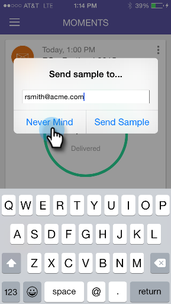

# 理解Marketo时刻{#understanding-marketo-moments}

Marketo的力量现在掌握在你手中 直接从您的手机或iPad预览和重新安排电子邮件。

>[!AVAILABILITY]
>
>
>需要“访问移动应用程序”权限。 请与您的Marketo管理员联系以[更新您的角色](/help/marketo/product-docs/administration/users-and-roles/managing-user-roles-and-permissions.md)。

## 流{#streams}

以下是“时刻”中的不同流。

>[!NOTE]
>
>**定义**
>
>* 瞬间：任何刚刚跑过或即将跑过的东西都会跑到这里。
>* 收藏夹：你最喜欢的东西都放在这里。
>* 稍后：比这个时刻更晚发生的一切都会在这里发生。
>* 完成：已完成运行或标记为“完成”的所有内容将在此处处理。

好了，既然我们已经解决了，让我们在电话上看一下Marketo时刻！

## 三种卡{#three-kinds-of-cards}

Marketo Moments为您提供了三张不同的信息卡，用于跟踪电子邮件的进度：

**现场**  — 此邮件即将发布。这是您预览示例、发送示例或甚至在必要时取消它的最后机会。

**心跳**  — 嘿 — 这封邮件正在送达！还有统计数据。 继续分享。

**结果**  — 以下是电子邮件的操作方式。电子邮件运行完成后，结果卡将显示参与分数和其他统计数据。

## 矩数流{#moments-stream}

当您首次打开应用程序或点按菜单中的&#x200B;**Moments**&#x200B;时，相关卡会首先显示。 每个计划都包含有关该特定营销计划及其整体表现的信息。

点击卡将打开一个详细信息屏幕。

>[!NOTE]
>
>橙色卡被确认；灰色的是试探性的。

点击三个点可打开卡操作菜单。

太棒了！ 现在，您可以通过点击：

>[!NOTE]
>
>**定义**
>
>* 收藏夹：如果您喜欢最及时、最重要的内容，则您很容易将注意力集中在这些内容上。
>* 完成：“完成”可从Marketo Moments视图中获得(但将它保留在Marketo中，安全、可靠)。
>* 共享：发送图像以激发您的团队的积极性或祝贺您的团队。
>* 发送示例（仅限电子邮件）：在您发送电子邮件之前，使用此功能让其他人查看电子邮件的外观。
>* 预览电子邮件（仅限电子邮件）：提前查看电子邮件总是个好主意。

## 稍后的时刻{#later-moments}

“稍后”部分显示即将进行的活动。

1. 开始。

   

1. 点按&#x200B;**稍后**。

   

   查看即将推出的活动的列表。

   

## 电子邮件项目卡{#email-program-cards}

电子邮件项目卡显示重要内容，如计划、受众、状态和其他有用信息，即使您在午餐时外出。

## 事件卡{#event-cards}

对于事件，您将看到成员总数及其状态。

## 分析卡{#analytics-cards}

Analytics时刻卡片会向您显示过去六个月中电子邮件和事件的月度表现，具体内容如下：

1. 获得的潜在客户
1. 新潜在客户
1. 取消订阅

## 智能活动运行卡{#smart-campaign-run-cards}

智能活动卡表示一次活动运行。 每次智能活动运行时都会显示新卡。 点击查看使用的智能列表过滤器、活动流以及活动中使用的每个电子邮件。

## 确认或取消操作{#confirm-or-cancel-an-action}

在每个步骤中，您都可以确认或取消操作。 如果您改变主意，只需点按&#x200B;**Never Mind**。

## 支持的版本{#supported-versions}

Marketo Moments支持以下操作系统版本：

* Apple iOS 8.0及更高版本。
* Android 4.1及更高版本（基本上是Jellybean和更高版本）。

准备好了解更多信息？

>[!MORELIKETHIS]
>
>* [了解电子邮件项目卡](/help/marketo/product-docs/core-marketo-concepts/mobile-apps/marketo-moments/understanding-moments/understanding-email-program-cards.md)
>* [了解事件卡](/help/marketo/product-docs/core-marketo-concepts/mobile-apps/marketo-moments/understanding-moments/understanding-event-cards.md)
>* [了解分析信息卡](/help/marketo/product-docs/core-marketo-concepts/mobile-apps/marketo-moments/understanding-moments/understanding-analytics-cards.md)
>* [了解智能活动卡](/help/marketo/product-docs/core-marketo-concepts/mobile-apps/marketo-moments/understanding-moments/understanding-smart-campaign-cards.md)

