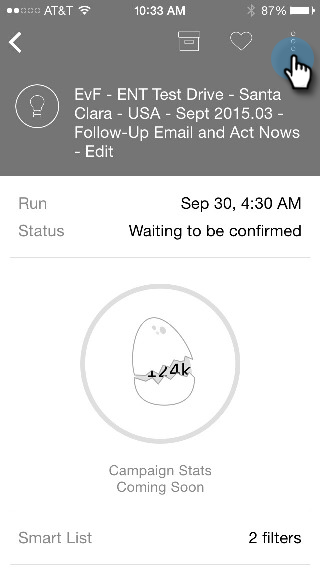
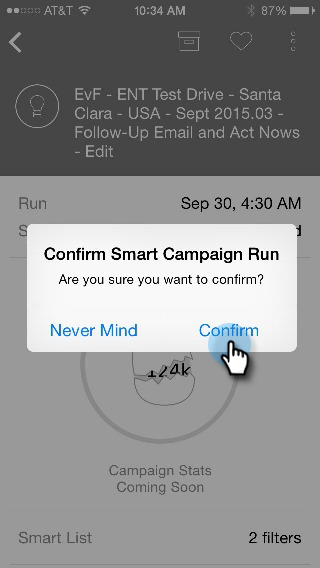

# 了解智能营销活动信息卡 {#understanding-smart-campaign-cards}

使用Marketo时刻从智能手机或iPad查看每次运行的智能营销活动。 Marketo时刻智能营销活动信息卡表示营销活动的一次运行；每次运行智能营销活动时，都会显示一张新信息卡。 智能营销活动卡在左上角标有一个灯泡。

对于已计划但尚未运行的未来智能营销活动， Marketo时刻卡不会显示任何营销活动统计数据。 它们将显示在将来的版本中。

## 智能营销活动信息卡 {#smart-campaign-cards}

1. 点按信息卡以打开详细信息卡。

   

1. 详细信息卡可让您访问有关智能列表筛选器、流量和电子邮件摘要的信息。

1. 点按 **智能列表**.

   

1. 此处显示智能列表使用的筛选器。

   

1. 点按 **流量**.

   

1. 现在，您将看到Smart Campaign流程。 此营销活动只有一个流程步骤，但可以有多个步骤。

   

1. 单击 **电子邮件摘要**.

   

1. 现在，您可以按数量和百分比查看收件人对各封电子邮件的回复。

   

1. 看到底下的那两个点了吗？ 它们表示有两封电子邮件连接到此智能营销活动。 要查看另一封电子邮件的结果，请向左滑动屏幕。 以下是第二封电子邮件的结果。

   

   >[!NOTE]
   >
   >请注意，现在其他圆点会高亮显示。

## 创建电子邮件示例和预览 {#creating-email-samples-and-previews}

在电子邮件发出之前查看一下会是个好主意。 或者，将样本发送给其他人，以便获得第二组眼睛。

1. 点按电子邮件上的三个点操作菜单。

   

1. 点按 [发送示例](/help/marketo/product-docs/core-marketo-concepts/mobile-apps/marketo-moments/working-with-moments/sending-a-sample.md) 或 [预览电子邮件](/help/marketo/product-docs/core-marketo-concepts/mobile-apps/marketo-moments/working-with-moments/previewing-an-email.md) （单击这些链接可查看详细信息）。

   

## 确认智能营销活动运行 {#confirming-a-smart-campaign-run}

未确认的智能营销活动的卡片为灰色，直到您确认为止。 然后，它们会变成橙色。

1. 要确认未确认的智能营销活动信息卡，请点按三点操作菜单。

   

1. 点按 **确认**.

   

1. 点按 **确认** 完成这项工作，或者 **没关系** 如果你有其他想法。

   

   >[!NOTE]
   >
   >现在，您的卡将变为橙色！

## 取消智能营销活动运行 {#canceling-a-smart-campaign-run}

您可以取消已确认的已计划智能营销活动运行。

1. 点按三点操作菜单。

   

1. 点按 **取消运行**.

   

1. 点按 **取消运行**. 如果您在最后一分钟决定不取消运行，请点击 **没关系**，智能营销活动将按计划运行。

   

## 重新计划智能营销活动 {#rescheduling-a-smart-campaign}

您可以重新计划尚未运行的已确认智能营销活动。

1. 点按三点操作菜单。

   

1. 点按 **重新计划**.

   

1. 在日历上选择日期并点击 **重新计划**.

   

   一块蛋糕！

## 其他智能营销活动操作 {#other-smart-campaign-actions}

与其他Marketo时刻卡一样，您可以点按任何Smart Campaign卡或详细信息卡上的三个圆点，以便：

* [使其成为收藏夹](/help/marketo/product-docs/core-marketo-concepts/mobile-apps/marketo-moments/working-with-moments/creating-a-favorite.md)
* [将其标记为“完成”](/help/marketo/product-docs/core-marketo-concepts/mobile-apps/marketo-moments/working-with-moments/marking-it-done.md)
* [共享](/help/marketo/product-docs/core-marketo-concepts/mobile-apps/marketo-moments/working-with-moments/sharing-a-moment.md)

>[!NOTE]
>
>您也可以点按 **共享** 图标，以及 **完成** 和 **收藏** 图标来显示详细信息。

## 快速删除智能营销活动信息卡 {#quickly-delete-a-smart-campaign-card}

如果您拥有不再需要的卡，或者您用于测试的卡，则可以通过向左或向右快速滑动将其删除。
