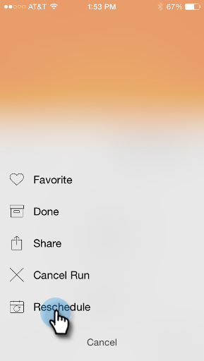
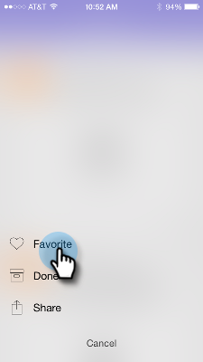

# 了解智能营销活动信息卡 {#understanding-smart-campaign-cards}

使用Marketo时刻从智能手机或iPad查看每次运行的智能营销活动。 Marketo时刻智能营销活动信息卡表示营销活动的一次运行；每次运行智能营销活动时，都会显示一张新信息卡。 Smart Campaign卡在左上角标有一个灯泡。

>[!IMPORTANT]
>
>2023年10月2日，Adobe从所有应用商店中删除了Marketo Ments应用程序。 如果您的平板电脑/移动设备上已安装该应用程序，则可以暂时继续使用该应用程序。 在将Marketo Engage实例迁移到Adobe Identity以便对Marketo进行身份验证后，您将无法再访问该应用程序。 [了解详情](https://nation.marketo.com/t5/product-discussions/marketo-events-app-and-marketo-moments-app-end-of-life/m-p/340712/highlight/true#M193869){target="_blank"}。

对于已计划但尚未运行的未来智能营销活动， Marketo时刻卡不会显示任何营销活动统计数据。 它们将显示在将来的版本中。

## 智能营销活动信息卡 {#smart-campaign-cards}

1. 点按信息卡以打开详细信息卡。

   

1. 详细信息卡允许您访问有关[!UICONTROL Smart List]筛选器、[!UICONTROL Flow]和[!UICONTROL Email Summary]的信息。

1. 点按&#x200B;**[!UICONTROL Smart List]**。

   

1. 此处显示智能列表使用的筛选器。

   

1. 点按&#x200B;**[!UICONTROL Flow]**。

   

1. 现在，您将看到Smart Campaign流程。 此营销活动只有一个流程步骤，但可以有多个步骤。

   

1. 单击 **[!UICONTROL Email Summary]**。

   

1. 现在，您可以按数量和百分比查看收件人对各封电子邮件的回复。

   

1. 看到底下的那两个点了吗？ 它们指示有两个电子邮件连接到此Smart Campaign。 要查看另一封电子邮件的结果，请向左滑动屏幕。 以下是第二封电子邮件的结果。

   

   >[!NOTE]
   >
   >请注意，现在其他圆点会高亮显示。

## 创建电子邮件示例和预览 {#creating-email-samples-and-previews}

在电子邮件发出之前查看一下会是个好主意。 或者，将样本发送给其他人，以便获得第二组眼睛。

1. 点按电子邮件上的三个点操作菜单。

   

1. 点按[[!UICONTROL Send Sample]](/help/marketo/product-docs/core-marketo-concepts/mobile-apps/marketo-moments/working-with-moments/sending-a-sample.md)或[[!UICONTROL Preview Email]](/help/marketo/product-docs/core-marketo-concepts/mobile-apps/marketo-moments/working-with-moments/previewing-an-email.md)（单击这些链接以了解详细信息）。

   

## 确认智能营销活动运行 {#confirming-a-smart-campaign-run}

未确认的智能营销活动的卡片呈灰色，直到您确认为止。 然后，它们会变成橙色。

1. 要确认未确认的Smart Campaign信息卡，请点按三点操作菜单。

   

1. 点按&#x200B;**[!UICONTROL Confirm]**。

   

1. 点按&#x200B;**[!UICONTROL Confirm]**&#x200B;以完成作业；或者，如果您有其他想法，请点按&#x200B;**[!UICONTROL Never Mind]**。

   

   >[!NOTE]
   >
   >现在，您的卡将变为橙色！

## 取消智能营销活动运行 {#canceling-a-smart-campaign-run}

您可以取消已确认的已计划Smart Campaign运行。

1. 点按三点操作菜单。

   

1. 点按&#x200B;**[!UICONTROL Cancel Run]**。

   

1. 点按&#x200B;**取消运行**。 如果您在最后一分钟决定不取消运行，请点按&#x200B;**无需担心**，Smart Campaign将按计划运行。

   

## 重新计划智能营销活动 {#rescheduling-a-smart-campaign}

您可以重新计划尚未运行的已确认Smart Campaign。

1. 点按三点操作菜单。

   

1. 点按&#x200B;**[!UICONTROL Reschedule]**。

   

1. 在日历上选择一个日期并点按&#x200B;**[!UICONTROL Reschedule]**。

   

   一块蛋糕！

## 其他智能营销活动操作 {#other-smart-campaign-actions}

与其他Marketo时刻卡一样，您可以点按任何Smart Campaign卡或详细信息卡上的三个圆点，以便：

* [使其成为收藏夹](/help/marketo/product-docs/core-marketo-concepts/mobile-apps/marketo-moments/working-with-moments/creating-a-favorite.md)
* [将其标记为“完成”](/help/marketo/product-docs/core-marketo-concepts/mobile-apps/marketo-moments/working-with-moments/marking-it-done.md)
* [共享](/help/marketo/product-docs/core-marketo-concepts/mobile-apps/marketo-moments/working-with-moments/sharing-a-moment.md)

>[!NOTE]
>
>您还可以点按要共享的Smart Campaign卡上的&#x200B;**[!UICONTROL Share]**&#x200B;图标，以及详细信息卡上的&#x200B;**[!UICONTROL Done]**&#x200B;和&#x200B;**[!UICONTROL Favorite]**&#x200B;图标。

## 快速删除智能营销活动信息卡 {#quickly-delete-a-smart-campaign-card}

如果您拥有不再需要的卡，或者您用于测试的卡，则可以通过向左或向右快速滑动将其删除。
