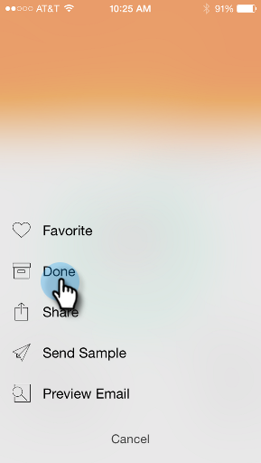

# 将其标记为“完成” {#marking-it-done}

将电子邮件程序、事件或分析卡标记为“完成”，以将其从流中删除。 有两种方法可以做到这一点。

1. 点按操作菜单。

   

1. 点按 **完成**.

   

1. 或者，向任意方向滑动卡。

   

   >[!NOTE]
   >
   >将信息卡标记为“完成”不会删除电子邮件、事件或智能营销活动。 它只会将其从“时刻”/“稍后”流移到“完成”流中。

一块蛋糕！
