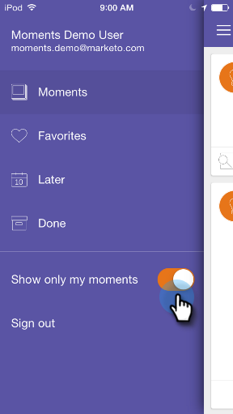

# 个性化 Marketo Moments {#personalizing-marketo-moments}

当有很多营销项目和明智的营销活动在进行时，能看到所有内容会很棒，但您可能只想专注于自己的工作。

>[!IMPORTANT]
>
>2023年10月2日，Adobe从所有应用商店中删除了Marketo Ments应用程序。 如果您的平板电脑/移动设备上已安装该应用程序，则可以暂时继续使用该应用程序。 在将Marketo Engage实例迁移到Adobe Identity以便对Marketo进行身份验证后，您将无法再访问该应用程序。 [了解详情](https://nation.marketo.com/t5/product-discussions/marketo-events-app-and-marketo-moments-app-end-of-life/m-p/340712/highlight/true#M193869){target="_blank"}。

启用&#x200B;**[!UICONTROL Show only my moments]**&#x200B;以仅显示您自己的电子邮件计划和智能营销活动。

或者，禁用&#x200B;**[!UICONTROL Show only my moments]**&#x200B;以查看您有权访问的所有智能营销活动和电子邮件程序。

