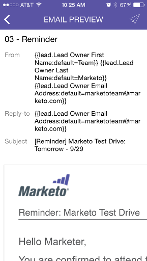

# 预览电子邮件{#previewing-an-email}

在扣动扳机之前，右键单击电子邮件卡以预览它。

1. 在电子邮件卡上，点按“三个点”操作菜单。

   

1. 点按&#x200B;**预览电子邮件**。

   

1. 您可以在设备上视图电子邮件。

   

   >[!NOTE]
   >
   >要直接从“电子邮件预览”页面发送示例，请点按右上角的纸质飞机图标。

   太棒了！
