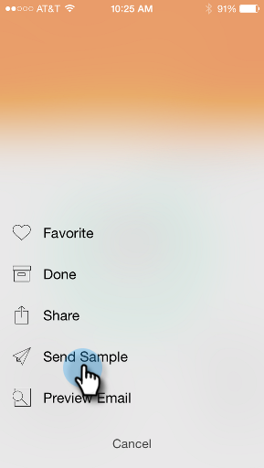
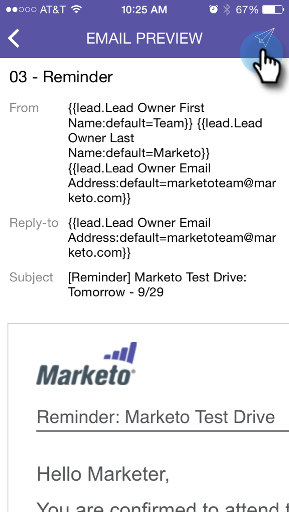

# 发送样本 {#sending-a-sample}

您可以直接与他人共享电子邮件时刻示例。 有两种方法可以做到这一点。

>[!IMPORTANT]
>
>2023年10月2日，Adobe从所有应用商店中删除了Marketo Ments应用程序。 如果您的平板电脑/移动设备上已安装该应用程序，则可以暂时继续使用该应用程序。 在将Marketo Engage实例迁移到Adobe Identity以便对Marketo进行身份验证后，您将无法再访问该应用程序。 [了解详情](https://nation.marketo.com/t5/product-discussions/marketo-events-app-and-marketo-moments-app-end-of-life/m-p/340712/highlight/true#M193869){target="_blank"}。

## 常规方式 {#the-regular-way}

1. 打开“卡片”菜单。

   

1. 点按&#x200B;**[!UICONTROL Send Sample]**。

   

1. 输入电子邮件地址并单击&#x200B;**[!UICONTROL Send Sample]**。

   

## 快速方法 {#the-quick-way}

1. 点按[!UICONTROL Email Preview]屏幕上的纸飞机图标，以直接从预览发送示例。

   
