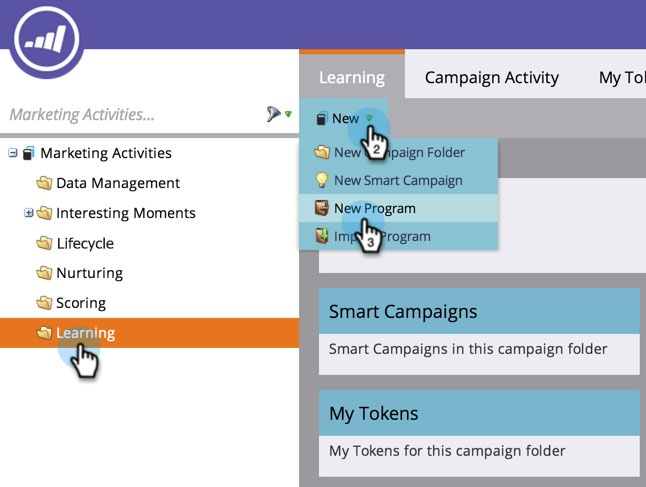

# 创建项目 {#create-a-program}

程序是Marketo中最重要的元素之一。 你会经常使用它们！

1. 前往 **[!UICONTROL Marketing Activities]**。

   

1. 为新项目选择文件夹。 选择 **[!UICONTROL New]** 并点击 **[!UICONTROL New Program]**。

   

1. 输入&#x200B;**[!UICONTROL Name]**，在下拉列表中选择&#x200B;**[[!UICONTROL Channel]](/help/marketo/product-docs/administration/tags/create-a-program-channel.md){target="_blank"}**，然后单击&#x200B;**[!UICONTROL Create]**。

   

>[!MORELIKETHIS]
>
>[了解程序](/help/marketo/product-docs/core-marketo-concepts/programs/creating-programs/understanding-programs.md){target="_blank"}。
