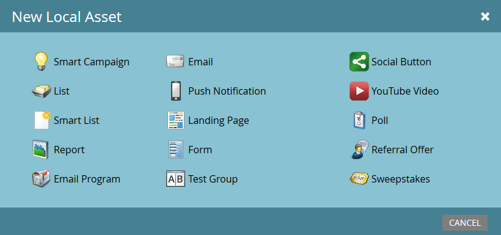

# 了解项目{#understanding-local-assets-in-a-program}中的本地资源

本地资源是组成您的项目的内容。 资产可自定义，使您能够构建自动化的营销计划。 以下是您可以在项目中创建的大多数本地资源：

>[!NOTE]
>
>并非所有客户都有权访问每个可用资产。 请联系您的客户代表以了解更多信息。

* [智能活动](/help/marketo/product-docs/core-marketo-concepts/smart-campaigns/creating-a-smart-campaign/understanding-batch-and-trigger-smart-campaigns.md)
* [列表](/help/marketo/product-docs/core-marketo-concepts/smart-lists-and-static-lists/static-lists/understanding-static-lists.md)
* [智能列表](/help/marketo/product-docs/core-marketo-concepts/smart-lists-and-static-lists/creating-a-smart-list/create-a-smart-list.md)
* [报告](/help/marketo/product-docs/reporting/basic-reporting/report-types/report-type-overview.md)
* [电子邮件项目](/help/marketo/product-docs/email-marketing/email-programs/creating-an-email-program/understanding-email-programs.md)
* [电子邮件](/help/marketo/product-docs/email-marketing/email-programs/email-program-actions/create-an-email-for-an-email-program.md)
* [推送通知](/help/marketo/product-docs/mobile-marketing/push-notifications/understanding-push-notifications.md)
* [登陆页](/help/marketo/product-docs/demand-generation/landing-pages/understanding-landing-pages/understanding-free-form-vs-guided-landing-pages.md)
* [Forms](/help/marketo/product-docs/demand-generation/forms/creating-a-form/create-a-form.md)
* [测试组](/help/marketo/product-docs/demand-generation/landing-pages/understanding-landing-pages/landing-page-test-groups.md)
* [社交按钮](/help/marketo/product-docs/demand-generation/landing-pages/free-form-landing-pages/add-a-social-button-to-a-free-form-landing-page.md)
* [Youtube视频](/help/marketo/product-docs/demand-generation/social/social-functions/add-a-video.md)
* [投票](/help/marketo/product-docs/demand-generation/social/creating-a-poll/create-a-poll.md)
* [推荐优惠](/help/marketo/product-docs/demand-generation/social/referral-offers/create-a-referral-offer.md)
* [抽奖活动](/help/marketo/product-docs/demand-generation/social/sweepstakes/create-sweepstakes.md)
* [查看SMS消息](/help/marketo/product-docs/mobile-marketing/vibes-sms-messages/create-a-vibes-sms-message.md)
