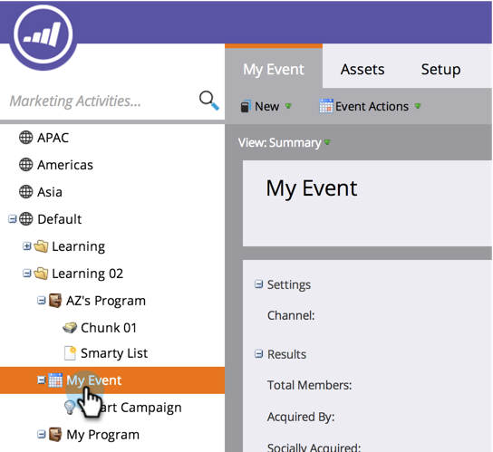

# 使用程序主页选项卡 {#using-the-program-home-tab}

“项目主页”(Program Home)选项卡为您提供了有关项目进展的概要视图。

## 摘要视图 {#summary-view}

1. 转到 **营销活动**.

   

1. 选择项目。

   

   >[!NOTE]
   >
   >这是您的默认视图。 它提供了有关设置、计划、结果和成员项目状态的信息。

1. 单击带下划线的元素可进行更改或查看更多信息。

   

1. 单击 **导出** 下载报表的摘要。

   

## 由视图使用 {#used-by-view}

1. 在营销活动中，选择一个项目。

   

1. 单击 **查看** 下拉菜单。 选择 **使用者**.

   

   此视图可向您展示正在使用的智能营销活动。

   

## 成员资格视图 {#membership-view}

1. 在营销活动中，选择一个项目。

   

1. 单击 **查看** 下拉菜单。 选择 **会员资格**.

   

   此图显示了成员在程序状态中移动时所在位置的图表。

   

   >[!NOTE]
   >
   >**历史** 表示曾参加过该项目的人，而 **当前** 仅包括当前参与该计划的人员。

   >[!MORELIKETHIS]
   >
   >[了解计划会员资格](/help/marketo/product-docs/core-marketo-concepts/programs/creating-programs/understanding-program-membership.md)
