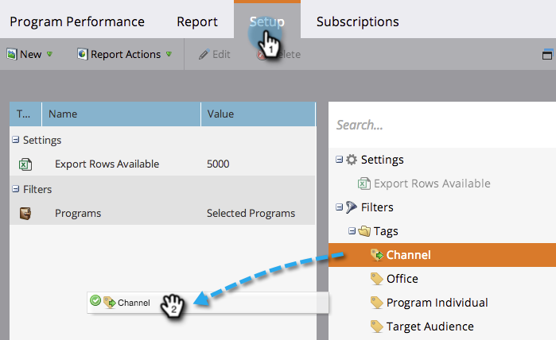

# 将项目群状态列添加到项目群报表 {#add-program-status-columns-to-a-program-report}

将有关项目状态的统计信息添加到您的 [方案执行情况报告](/help/marketo/product-docs/core-marketo-concepts/programs/program-performance-report/create-a-program-performance-report.md).

1. 转到营销活动（或Analytics）。

   

1. 选择您的报表。

   

1. 单击 **设置** 制表符并拖动到“渠道”标记上。

   

1. 选择要作为筛选依据的渠道。

   

   >[!TIP]
   >
   >要显示项目状态列，报告必须按以下条件过滤 _只有一个_ 渠道。

1. 选中显示程序状态列的选项。 单击 **应用**.

   

1. 你做到了！ 单击报告选项卡可查看您的报告以及项目群状态列。

   

>[!NOTE]
>
>如果您在程序中看不到每个状态的列，请确保您已 [已选择要显示的列](/help/marketo/product-docs/reporting/basic-reporting/editing-reports/select-report-columns.md) 在报表中。

>[!MORELIKETHIS]
>
>[按标记过滤项目报告](/help/marketo/product-docs/core-marketo-concepts/programs/program-performance-report/filter-a-program-report-by-tag.md)
