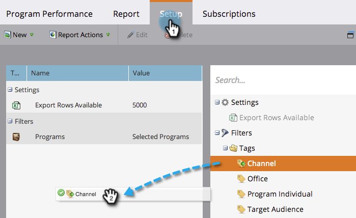
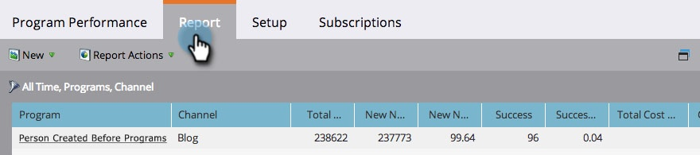

# 向项目报告添加项目状态列 {#add-program-status-columns-to-a-program-report}

将有关项目状态的统计信息添加到您的[项目性能报告](/help/marketo/product-docs/core-marketo-concepts/programs/program-performance-report/create-a-program-performance-report.md){target="_blank"}。

1. 转到&#x200B;**[!UICONTROL Marketing Activities]**（或&#x200B;**[!UICONTROL Analytics]**）。

   

1. 选择您的报表。

   

1. 单击&#x200B;**[!UICONTROL Setup]**&#x200B;选项卡并拖动到&#x200B;**[!UICONTROL Channel]**&#x200B;标记上。

   

1. 选择要作为筛选依据的渠道。

   

   >[!TIP]
   >
   >要显示项目状态列，您的报告必须仅按&#x200B;_一个_&#x200B;渠道进行筛选。

1. 选中显示程序状态列的选项。 单击 **[!UICONTROL Apply]**。

   

1. 单击[!UICONTROL Report]选项卡可查看您的报表以及项目状态列。

   

>[!NOTE]
>
>如果您在程序中看不到每个状态的列，请确保您已[选择要在报表中显示的列](/help/marketo/product-docs/reporting/basic-reporting/editing-reports/select-report-columns.md){target="_blank"}。

>[!MORELIKETHIS]
>
>[按标记筛选项目报告](/help/marketo/product-docs/core-marketo-concepts/programs/program-performance-report/filter-a-program-report-by-tag.md){target="_blank"}
