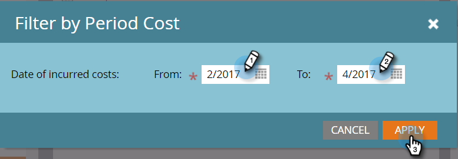

# 按期间成本筛选程序报表 {#filter-a-program-report-by-period-cost}

集中您的 [项目绩效报告](/help/marketo/product-docs/core-marketo-concepts/programs/program-performance-report/create-a-program-performance-report.md) 特定时段成本时间范围。

1. 转到 **营销活动** (或 **Analytics**)。

   

1. 选择您的项目绩效报告。

   

1. 单击 **设置** 选项卡，并拖动 **期间成本**.

   

1. 输入 **从** 和 **至** 产生成本的日期和点击 **应用**.

   

1. 你完了！ 单击 **报表** 选项卡，以仅查看在指定时间段成本时间范围内的程序。

   

   >[!NOTE]
   >
   >[按程序过滤程序报表](/help/marketo/product-docs/core-marketo-concepts/programs/program-performance-report/filter-a-program-report-by-program.md)
