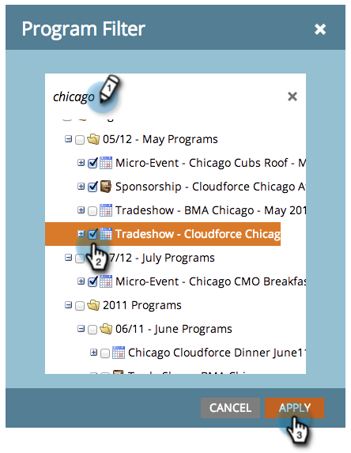

# 按程序过滤程序报表 {#filter-a-program-report-by-program}

集中您的 [项目绩效报告](/help/marketo/product-docs/core-marketo-concepts/programs/program-performance-report/create-a-program-performance-report.md) 来比较其性能。

1. 转到 **营销** **活动** (或 **Analytics**)。

   

1. 选择您的项目绩效报告。

   

1. 单击 **设置** 选项卡，并拖动 **程序**.

   

1. 选择要包含在报表中的文件夹和特定程序。

   

   >[!TIP]
   >
   >如果选择文件夹，则报表将包含运行报表时该文件夹包含的所有内容。

1. 仅此而已！ 单击 **报表** 选项卡查看 _just_ 报表中的选定项目。

   

   >[!NOTE]
   >
   >[按标记过滤程序报表](/help/marketo/product-docs/core-marketo-concepts/programs/program-performance-report/filter-a-program-report-by-tag.md)
