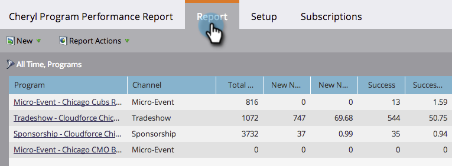

# 按项目筛选项目报告 {#filter-a-program-report-by-program}

将项目性 [能报告集中于](create-a-program-performance-report.md) 特定项目，以比较其性能。

1. 转至 **营销****活动****(**&#x200B;或Analytics)。

   

1. 选择项目性能报告。

   

1. 单击“设 **置** ”选项卡并拖 **动项目**。

   

1. 选择要包含在报表中的文件夹和特定项目。

   

   >[!TIP]
   >
   >如果选择文件夹，则报表将包含运行报表时该文件夹包含的所有内容。

1. 仅此而已！ 单击 **报表** 选项卡 *，只* 查看报表中的选定项目。

   

   >[!NOTE]
   >
   >**相关文章**
   >
   >    
   >    
   >    * [按标记筛选项目报告](filter-a-program-report-by-tag.md)

   >[!NOTE]
   >
   >**深潜**
   >
   >
   >了解有关基本报告中 [的报告](http://docs.marketo.com/display/docs/basic+reporting)。

