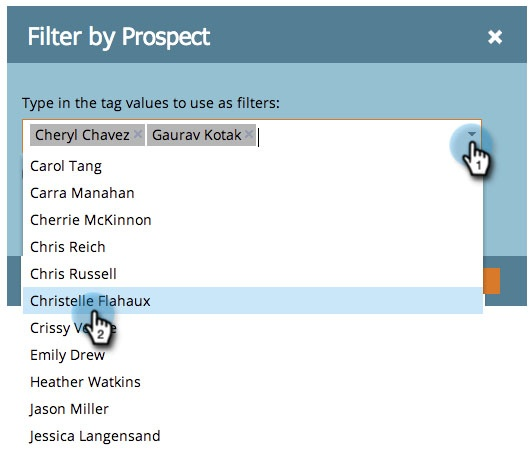

# 按标记过滤项目报告 {#filter-a-program-report-by-tag}

将您的[项目性能报告](/help/marketo/product-docs/core-marketo-concepts/programs/program-performance-report/create-a-program-performance-report.md)集中在特定的[标记](/help/marketo/product-docs/core-marketo-concepts/programs/working-with-programs/understanding-tags.md){target="_blank"}上。

1. 转到&#x200B;**[!UICONTROL 营销活动]**（或&#x200B;**[!UICONTROL Analytics]**）。

   

1. 选择您的&#x200B;**[!UICONTROL 项目绩效]**&#x200B;报告。

   

1. 单击&#x200B;**[!UICONTROL 设置]**&#x200B;选项卡，并拖动到其中一个&#x200B;**[!UICONTROL 标记]**&#x200B;筛选器上。

   

1. 选择要包含在报表中的标记值。

   

1. 单击&#x200B;**[!UICONTROL 应用]**。

   

1. 完成！ 单击“**[!UICONTROL 报表]**”选项卡以查看&#x200B;_仅_&#x200B;与报表中所选标记匹配的程序。

   

>[!NOTE]
>
>[按期间成本筛选项目报告](/help/marketo/product-docs/core-marketo-concepts/programs/program-performance-report/filter-a-program-report-by-period-cost.md){target="_blank"}
