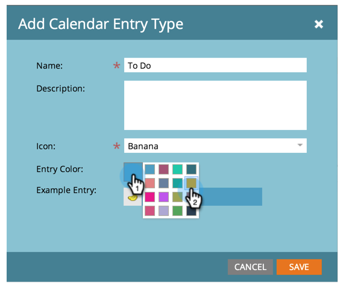

# 创建自定义条目类型 {#create-custom-entry-types}

您可以创建要在“程序计划视图”中使用的自定义条目类型。 这样，您就可以跟踪所有影响您计划的非Marketo议程项目。

1. 转到 **管理员** 部分，单击 **标记**.

   

1. 单击 **日历条目类型**.

   

1. 单击 **新建** 下拉框并选择 **条目类型**.

   

1. 命名您的条目并选择一个图标。

   

1. 选择 **条目颜色**.

   

1. 单击 **保存**.

   

太棒了！ 现在，当您在计划视图中创建新条目时，此类型将成为一个选项。

>[!NOTE]
>
>您最多可以创建100种自定义条目类型。
