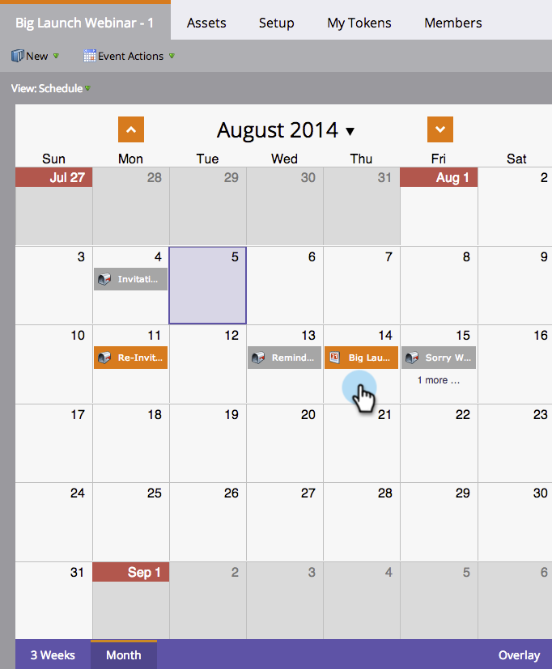

# 在项目计划视图{#creating-a-batch-smart-campaign-in-the-program-schedule-view}中创建批智能活动

您可以创建新的智能活动，并从项目计划视图中重新运行项目内现有的智能](/help/marketo/product-docs/core-marketo-concepts/programs/program-schedule-view/rerun-a-smart-campaign-in-the-program-schedule-view.md)。[

>[!NOTE]
>
>在此视图中只能创建批量智能活动。 不支持触发器活动。

1. 选择希望运行新智能活动的日期。

   

1. 为您的条目选择一个名称，该名称将成为您的新智能活动。 按&#x200B;**Enter/Return**&#x200B;键确认名称。

   

1. 单击&#x200B;**类型**&#x200B;下拉框并选择&#x200B;**智能活动**。

   

   >[!NOTE]
   >
   >您还可以从下拉菜单中选择现有智能活动来运行它。

   

1. 选择[智能活动](/help/marketo/product-docs/core-marketo-concepts/smart-campaigns/creating-a-smart-campaign/create-a-new-smart-campaign.md)规则。

   

1. 您现在将在计划视图和条目详细信息中看到此智能活动已确认。

   

这将在您的项目中创建一个新的智能活动运行。
