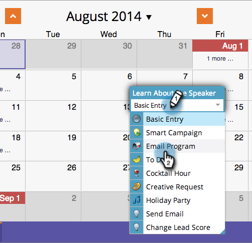

# 在“计划”视图中创建新电子邮件程序 {#creating-a-new-email-program-in-the-schedule-view}

您可以从项目计划视图内构建电子邮件项目。 下面是具体操作方法。

1. 转到 **营销活动**.

   

1. 选择您的项目。

   

1. 选择您希望电子邮件程序运行的日期。

   

1. 输入名称。 选择 **电子邮件程序**.

   

1. 在条目详细信息中，单击指向您的新电子邮件程序的链接。

   

1. [设置您的电子邮件程序](/help/marketo/product-docs/email-marketing/email-programs/creating-an-email-program/create-an-email-program.md) 并单击 **批准项目**.

   

   除了详细仪表板之外，使用 [电子邮件程序](/help/marketo/product-docs/email-marketing/email-programs/creating-an-email-program/understanding-email-programs.md) 能够轻松地实施 [A/B测试](/help/marketo/product-docs/email-marketing/email-programs/email-program-actions/email-test-a-b-test/add-an-a-b-test.md). 尽情享受！
