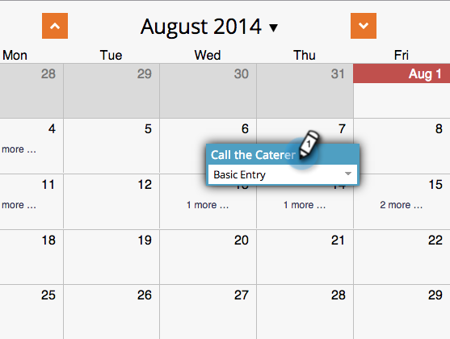
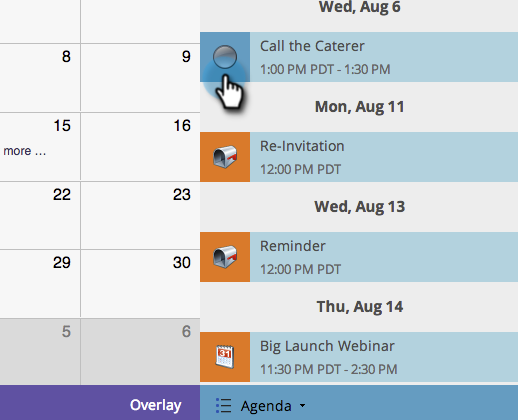
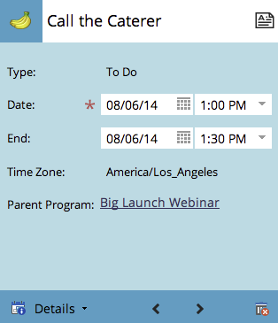

# 在项目计划视图{#creating-an-entry-in-the-program-schedule-view}中创建条目

您可以从项目计划视图中创建条目以补充现有项目。

## 创建基本条目{#create-a-basic-entry}

1. 转至&#x200B;**营销活动**。

   

1. 选择项目。 单击&#x200B;**视图**&#x200B;下拉列表。 选择&#x200B;**计划**。

   

1. 单击某天将条目添加到。

   

1. 命名条目。 按&#x200B;**输入**&#x200B;确认名称。

   

1. 选择新条目的开始和结束日期/时间。

   

1. 单击说明图标以添加其他信息。

   

1. 输入您的说明，然后单击&#x200B;**保存**。

   

1. 将鼠标悬停在描述图标上，可视图条目描述。

   

## 更改条目类型{#change-entry-type}

1. 从&#x200B;**议程**&#x200B;视图中选择一个基本条目。

   

1. 选择&#x200B;**类型**&#x200B;下拉列表。 选择新条目类型。

   >[!NOTE]
   >
   >待办事项是[自定义条目](/help/marketo/product-docs/core-marketo-concepts/programs/program-schedule-view/create-custom-entry-types.md)。 您可以制作待办事项和其他自定义条目，以帮助跟踪非Marketo议程项目。

   

   真酷！ 您应立即看到更改。

   

>[!NOTE]
>
> 您还可以从活动视图创建[智能项目](/help/marketo/product-docs/core-marketo-concepts/programs/program-schedule-view/creating-a-batch-smart-campaign-in-the-program-schedule-view.md)或[电子邮件计划](/help/marketo/product-docs/core-marketo-concepts/programs/program-schedule-view/creating-a-new-email-program-in-the-schedule-view.md)。
