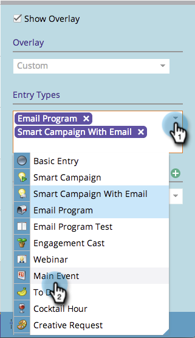

# 在程序计划视图中创建自定义叠加图 {#creating-custom-overlays-in-program-schedule-view}

您可以创建自定义叠加以查看与您的需求相关的条目。

1. 单击 **议程** 下拉菜单。

   

1. 选择 **叠加**.

   

1. 选择要在叠加图中显示的条目类型。

   

1. 您还可以按 [项目标签](/help/marketo/product-docs/core-marketo-concepts/programs/working-with-programs/understanding-tags/use-tags-in-a-program.md).

   

   太棒了。 现在，您的叠加将仅显示您定义的条目。

   
