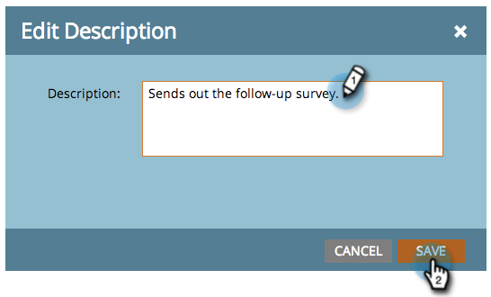
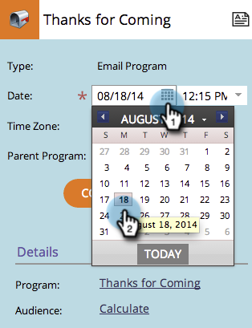

# 在项目计划视图{#editing-entries-in-the-program-schedule-view}中编辑条目

您可以在项目视图中对计划的不同元素进行编辑。

## 编辑条目名称{#edit-an-entrys-name}

1. 选择要编辑的条目。

   

1. 键入新名称并按键盘上的&#x200B;**Enter/Return**&#x200B;以确认更改。

   

>[!CAUTION]
>
>这只会更改计划视图中的显示名称。 您所在项目的资产名称将保持不变。

## 编辑条目的说明{#edit-an-entrys-description}

1. 单击描述图标。

   

1. 编辑您的描述。 单击&#x200B;**保存**。

   

1. 太好了！ 您的描述现在已更改。

   

## 编辑条目的日期{#edit-an-entrys-date}

1. 选择新日期。

   

你摇滚！ 现在，您的输入日期已移至新日期。

>[!NOTE]
>
> 已运行的智能活动和电子邮件项目条目无法移至过去。

