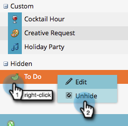

# 隐藏和取消隐藏自定义条目类型{#hiding-and-unhiding-custom-entry-types}

自定义条目类型可隐藏在“管理员”部分中。 隐藏后，条目类型将不再显示为选项。

## 隐藏自定义条目类型{#hide-a-custom-entry-type}

1. 转至&#x200B;**Admin**&#x200B;部分，然后单击&#x200B;**日历条目** **类型**。

   

1. 右键单击自定义条目，然后单击&#x200B;**隐藏**。

   

   太棒了。 此条目类型将不再可用。

## 取消隐藏自定义条目类型{#unhide-a-custom-entry-type}

如果要取消隐藏自定义条目类型，也很容易。

1. 右键单击条目，然后选择&#x200B;**取消隐藏**。

   

   太！ 您的自定义条目类型现在已取消隐藏。

   
