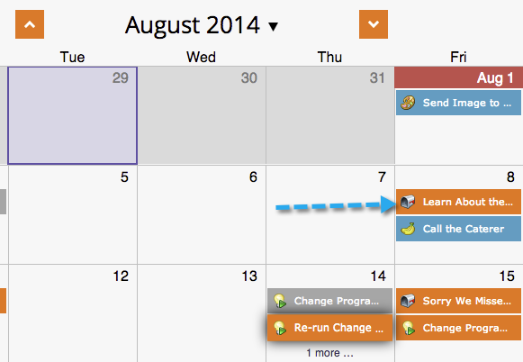

# 在项目计划视图中移动条目 {#moving-entries-in-the-program-schedule-view}

在计划视图中移动条目将自动重新计划它们。

>[!NOTE]
>
>无法移动已运行的智能营销活动、参与项目或邮件爆炸。

1. 选择您的条目。 将其拖放到其他日期。

   

1. Marketo会自动取消批准、更改日期并重新批准资源。

   

   您的输入将立即重新计划。

   
