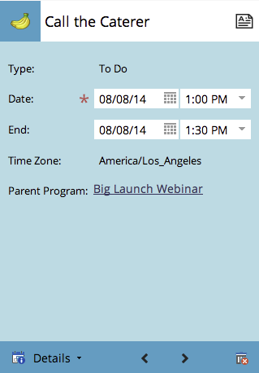

# 导航项目计划视图{#navigating-the-program-schedule-view}

以下是帮助您导航项目计划视图的基础知识。

## 查找计划视图{#find-the-schedule-view}

1. 转至&#x200B;**营销活动**。

   

1. 选择项目。 单击&#x200B;**视图**&#x200B;下拉列表。 选择&#x200B;**计划**。

   

   现在您将看到您项目的计划视图。

   

>[!NOTE]
>
>项目计划视图粘滞。 设置后，所有项目将默认为计划视图。

## 在条目{#switching-between-entries}之间切换

1. 在条目详细信息中，单击箭头可移至下一个计划的条目。

   

   很酷吧？

   

## 视图上下文菜单{#view-context-menu}

1. 右键单击任何项目，即可对项目、智能列表、设置、我的令牌或成员进行编辑。

   

## 在模式{#changing-between-modes}之间更改

1. 单击&#x200B;**3周**&#x200B;或&#x200B;**月**&#x200B;将更改显示屏上的可见日期。

   

## 全屏视图{#full-screen-view}

1. 您可以单击右上角的屏幕图标，以全屏模式视图项目计划。

   

太棒了！ 现在，您知道如何视图项目，让我们学习它可以做的其他很酷的事情。

>[!MORELIKETHIS]
>
>[在项目计划视图中创建条目](/help/marketo/product-docs/core-marketo-concepts/programs/program-schedule-view/creating-an-entry-in-the-program-schedule-view.md)
