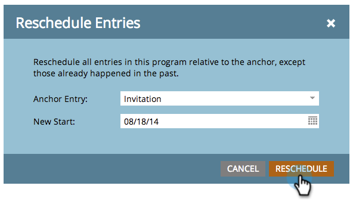
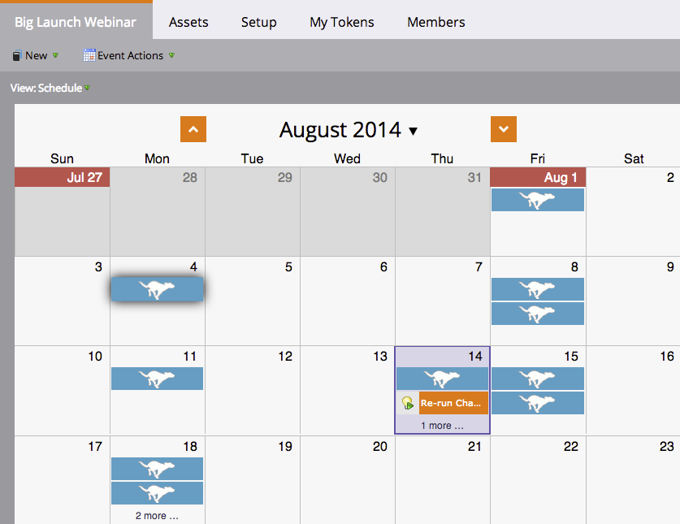

# 从计划视图{#rescheduling-an-entire-program-from-the-schedule-view}重新计划整个项目

当您克隆具有日期的项目或事件时，您可能希望一次重新计划所有日期。 下面介绍如何操作。

1. 选择要重新计划的项目。

   

1. 选择“事件操作”下拉列表。 选择&#x200B;**重新计划条目**。

   

1. 选择锚点条目。 根据此移动，所有其他条目都将随之移动。

   

1. 选择新开始日期。

   

1. 单击&#x200B;**重新计划**。

   

1. 然后，我们的数据检索器将取消批准、重新计划和重新批准您所有具有正确日期的资产！

   

>[!NOTE]
>
>已运行的资产将不会移动。

现在，一切都重新安排了。 根据需要调整任何特定日期。

