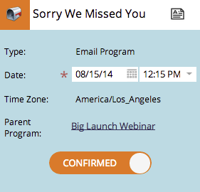

# 了解暂定/确认日期 {#understanding-tentative-confirmed-dates}

智能营销活动和电子邮件计划具有强大的标记功能 **试探性** 或 **已确认**. 这是他们的工作方式。

## 试探性 {#tentative}

暂定日期传达了意图。 把这想成 _盆栽_ 日历里有东西。 暂定条目将不会运行 — 它们仅是占位符。

>[!NOTE]
>
>只有批量智能营销活动和电子邮件程序才可能是暂定项目。

## 确认条目 {#confirming-entries}

这就像批准资产一样，因此在确认资产之前，需要完全设置条目。 所有鸭子排成一列后，你可以在右侧滑动“试探性”选项卡来确认条目。

>[!NOTE]
>
>为什么狗？ 他是猎犬。 他在取你的数据。

## 已确认 {#confirmed}

确认的条目肯定会运行。 他们有规则、已批准的资产以及确认的日期和时间。

## 已完成  {#finished}

已完成的条目已运行。 他们只能是过去（显然）。 在某个条目运行并为 **已完成**，则无法移动或试用。 （不改变现实，不会破坏时间流连续体。）

这些状态是强大的工具。 克隆项目时，所有智能营销活动和电子邮件项目日期都将是暂定的。 可以从计划视图中直接确认这些参数。 很酷吧？
