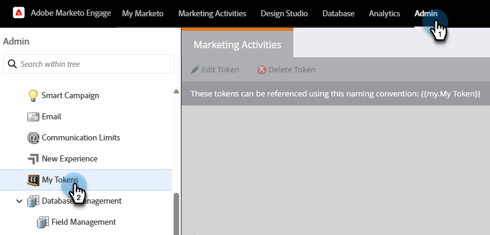

# 管理我的令牌 {#managing-my-tokens}

使用令牌可以简化您在Marketo Engage中的工作。 您可以在流程步骤、Webhook、电子邮件和登陆页面中使用[我的令牌](/help/marketo/product-docs/core-marketo-concepts/programs/tokens/understanding-my-tokens-in-a-program.md){target="_blank"}（自定义令牌）。 这是如何制作它们。

>[!TIP]
>
>进一步了解[令牌概述](/help/marketo/product-docs/demand-generation/landing-pages/personalizing-landing-pages/tokens-overview.md){target="_blank"}中已提供哪些令牌。

## 创建本地或全局我的令牌 {#create-a-my-token}

>[!BEGINTABS]

>[!TAB 本地My令牌]

1. 在&#x200B;**[!UICONTROL Marketing Activities]**&#x200B;中，选择所需的项目或营销策划文件夹，然后单击其&#x200B;**[!UICONTROL My Tokens]**&#x200B;选项卡。

   

1. 将所需的“我的令牌”拖动到画布上。

   

1. 键入唯一名称并输入相关值。

   

1. 单击 **[!UICONTROL Save]**。

   

>[!TAB 全局我的令牌]

>[!NOTE]
>
>需要管理员权限。

1. 转到&#x200B;**[!UICONTROL Admin]**&#x200B;区域并选择&#x200B;**[!UICONTROL My Tokens]**。

   

1. 将所需的“我的令牌”拖动到画布上。

   

1. 键入唯一名称并输入相关值。

   

1. 单击 **[!UICONTROL Save]**。

   

>[!ENDTABS]

## 编辑我的令牌 {#edit-a-my-token}

1. 选择要编辑的令牌并单击&#x200B;**[!UICONTROL Edit Token]**。

   

1. 进行所需的编辑。 完成后单击&#x200B;**[!UICONTROL Save]**。

   

## 删除我的令牌 {#delete-a-my-token}

>[!CAUTION]
>
>删除“我的令牌”时，请确保该令牌当前未在任何资产中引用。 如果删除，则被引用的任何位置将显示一个空格。

1. 选择要删除的令牌并单击&#x200B;**[!UICONTROL Delete Token]**。

   

1. 单击 **[!UICONTROL Delete]**。

   

   >[!MORELIKETHIS]
   >
   >* [令牌概述](/help/marketo/product-docs/demand-generation/landing-pages/personalizing-landing-pages/tokens-overview.md){target="_blank"}
   >* [了解项目群中的我的令牌](/help/marketo/product-docs/core-marketo-concepts/programs/tokens/understanding-my-tokens-in-a-program.md){target="_blank"}
   >* [在我的令牌中使用URL](/help/marketo/product-docs/email-marketing/general/using-tokens/using-urls-in-my-tokens.md){target="_blank"}
