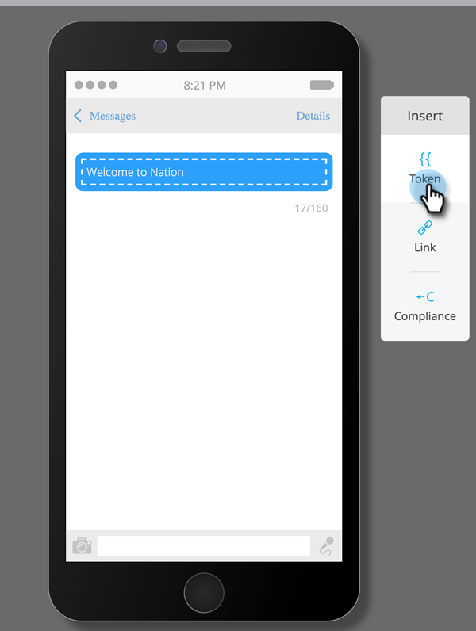

# 项目成员自定义字段令牌{#program-member-custom-field-tokens}

## 项目成员自定义字段{#token-support-for-program-member-custom-fields}的令牌支持

在项目成员自定义字段功能的背面，令牌框架中对项目成员自定义字段的支持正在扩展。

PMCF令牌将在令牌系列的成员域下受支持。

成员令牌用于项目成员范围内的字段。 自当前状态起，会员令牌还用于插入集成服务合作伙伴的唯一值。 `{{member.webinar url}}` token会自动解析由服务提供商生成的个人唯一确认URL。{{member.registration code}}}解析为服务提供商提供的注册代码。

>[!NOTE]
>
>* 项目成员自定义字段只能在项目的上下文中使用。
>* 项目成员自定义字段令牌不能在以下位置使用：电子邮件脚本、电子邮件预头、等待步骤中的日期令牌或代码片段。
>* 项目成员状态在成员令牌中不受支持。

## 在资产{#using-program-member-custom-field-tokens-in-assets}中使用项目成员自定义字段令牌

您可以将项目成员自定义字段令牌插入电子邮件、登陆页、短信、推送通知和网络挂钩。

**电子邮件**

1. 选择所需的电子邮件，然后单击&#x200B;**编辑草稿**。

   

1. 单击“插入令牌”图标。

   

1. 查找并选择所需的项目成员自定义字段令牌，输入默认值，然后单击&#x200B;**插入**。

   

1. 单击&#x200B;**保存**。

   

>[!NOTE]
>
>不要忘记批准您的电子邮件。

**登陆页**

1. 选择您的登陆页，然后单击&#x200B;**编辑草稿**。

   

   >[!NOTE]
   >
   >登陆页设计器在新窗口中打开。

1. 多次 — 单击要添加令牌的富文本框。

   

1. 单击要将令牌添加到的位置，然后单击插入令牌图标。

   

1. 查找并选择所需的标记。

   

1. 输入默认值，然后单击&#x200B;**插入**。

   

1. 单击&#x200B;**保存**。

   

**SMS**

1. 选择所需的SMS并单击&#x200B;**编辑草稿**。

   

1. 单击&#x200B;**`{{ Token`**&#x200B;按钮。

   

1. 查找并选择所需的项目成员自定义字段令牌。 输入默认值，然后单击“插入”。

   

1. 单击“SMS操作”下拉框，然后选择&#x200B;**批准并关闭**。

   

**推送通知**

1. 选择所需的推送通知，然后单击&#x200B;**编辑草稿**。

   

1. 单击&#x200B;**推送通知**。

   

1. 单击编辑器中的消息，然后单击`{{`按钮以获取令牌选择器。

   

1. 查找并选择所需的项目成员自定义字段令牌。 输入默认值并单击&#x200B;**插入**。

   

1. 单击&#x200B;**完成**&#x200B;以保存并退出（或单击&#x200B;**下一步**&#x200B;以首先查看）。

   

>[!NOTE]
>
>如果项目成员的项目成员自定义字段没有值，则标记将替换为默认值（如果已提供）。

## 在活动{#using-program-member-custom-field-tokens-in-campaigns}中使用项目成员自定义字段令牌

项目成员自定义字段令牌可用于：

* 创建任务
* 在Microsoft中创建任务
* 有趣的时刻
* 更改数据值流动操作
* Webhooks
