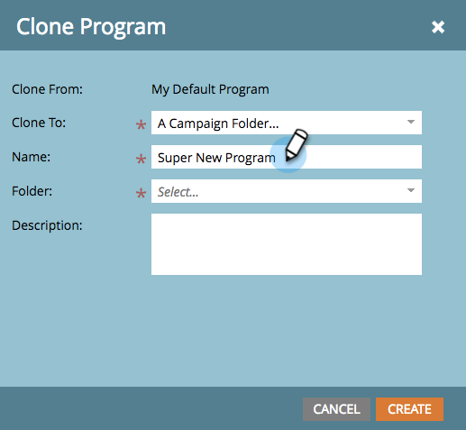
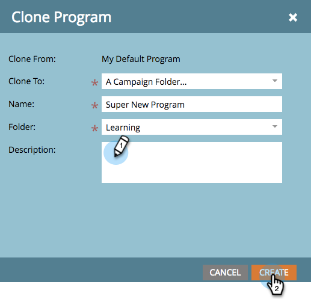

# 克隆程序 {#clone-a-program}

快速、轻松地克隆整个程序及其所有资产，而不是手动重建所有内容。

>[!PREREQUISITES]
>
>在潜入之前，了解 [避免克隆资产损坏的最佳实践](https://nation.marketo.com/t5/Knowledgebase/Avoiding-Corruption-in-Cloned-Assets/ta-p/249729).

1. 查找并选择要克隆的程序，然后在 **计划操作** 单击 **克隆**.

   

1. 选择要将程序克隆到的位置。

   >[!NOTE]
   >
   >可以将程序克隆到 [营销活动](/help/marketo/product-docs/core-marketo-concepts/miscellaneous/create-new-campaign-folder.md) [文件夹](/help/marketo/product-docs/core-marketo-concepts/miscellaneous/create-new-campaign-folder.md) 或 [工作区](/help/marketo/product-docs/administration/workspaces-and-person-partitions/create-a-new-workspace.md). 确保共享所有基础的从属资产（电子邮件、片段、登陆页面模板等） 与目标工作区一起复制。

   

   >[!NOTE]
   >
   >请参阅上面屏幕截图中的注释？ 这意味着如果您克隆的程序列表中包含1000个或更多人，则列表本身将被克隆，但将为空。 如果克隆的程序的列表包含999人或更少，则该列表及其所有成员将显示在克隆的程序中。

1. 输入名称。

   

1. 选择要将程序克隆到的文件夹。

   

1. 添加可选描述，然后单击 **创建**. 了解您有多快才能创建一个新项目，并准备好所有资产！

   

   >[!TIP]
   >
   >将此技术与令牌结合使用，使新程序创建变得快捷。

   >[!CAUTION]
   >
   >期间成本不会转移，因此，如果在原始程序中设置了期间成本，请务必将其添加到克隆程序中。
