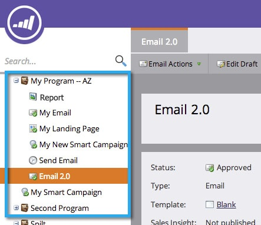

# 在程序中克隆资产 {#clone-an-asset-in-a-program}

克隆程序克隆 _全部_. 有时您只想克隆一个资源。 具体方法如下。

>[!NOTE]
>
>您需要执行其他步骤，以 [克隆登陆页面测试组](/help/marketo/product-docs/demand-generation/landing-pages/landing-page-actions/cloning-a-landing-page-test-group.md).

## 克隆本地资产 {#clone-a-local-asset}

1. 转到 **营销** **活动**.

   

1. 选择您的项目。

   

1. 右键单击要克隆的本地资产。 单击 **克隆**.

   

1. 每种资源都会显示不同的对话框。 只需填写信息并单击 **克隆**.

   

   >[!TIP]
   >
   >您还可以将资产克隆到其他程序。 使用 **项目** 下拉菜单进行选择。

1. 太棒了！ 您现在应该会看到新的克隆资产。

   

   >[!NOTE]
   >
   >[克隆程序](/help/marketo/product-docs/core-marketo-concepts/programs/working-with-programs/clone-a-program.md)
