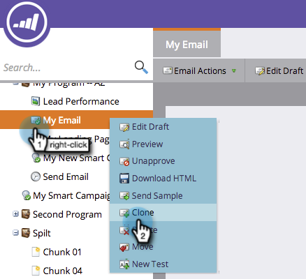

# 在项目{#clone-an-asset-in-a-program}中克隆资源

克隆项目克隆&#x200B;_所有_。 有时，您只想克隆一个资源。 下面介绍如何操作。

>[!NOTE]
>
>您需要执行其他步骤来[克隆登陆页测试组](/help/marketo/product-docs/demand-generation/landing-pages/landing-page-actions/cloning-a-landing-page-test-group.md)。

## 克隆本地资源{#clone-a-local-asset}

1. 转至&#x200B;**Marketing** **活动**。

   

1. 选择项目。

   

1. 右键单击要克隆的本地资源。 单击&#x200B;**克隆**。

   

1. 每种资源都显示一个不同的对话框。 只需填写信息，然后单击&#x200B;**克隆**。

   

   >[!TIP]
   >
   >您还可以将资源克隆到其他项目。 使用&#x200B;**项目**&#x200B;下拉列表进行选择。

1. 太棒了！ 您现在应该可以看到新的克隆资源。

   

   >[!NOTE]
   >
   >[克隆项目](/help/marketo/product-docs/core-marketo-concepts/programs/working-with-programs/clone-a-program.md)
