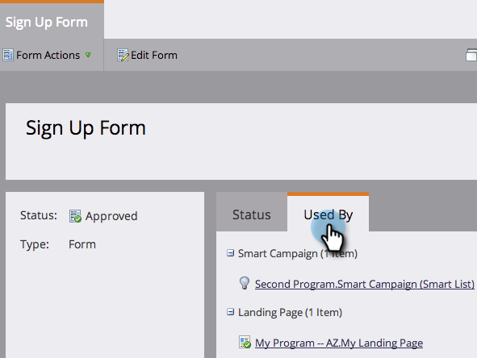

# 删除项目群 {#delete-a-program}

您可以存档程序，但有时您只想永久删除它。 下面是具体操作方法。

1. 选择要删除的程序。

1. 单击 **项目操作**. 单击 **删除**.

   

1. 选择全部删除选项。 查看程序删除的副作用，然后单击 **删除** 以确认。

>[!TIP]
>
>**存档程序** 会保留程序数据，但会阻止程序运行。 选择该选项，然后单击 **下一个** 查看有关归档的更多详细信息。

完成. 就好像这个计划从没存在过。

## 为什么无法删除我的项目？ {#why-cant-i-delete-my-program}

程序可以包含系统中其他位置使用的资产 — 这将阻止您删除程序。

要解决此问题，您可能需要深入分析并取消批准/删除。 请按照以下步骤操作。

1. 单击链接以转到资产。

   

1. 单击 **使用者** 以查看资产的使用位置。

   

   知道资产的使用位置后，转到该位置并取消批准/删除。 然后再次尝试删除您的项目。
