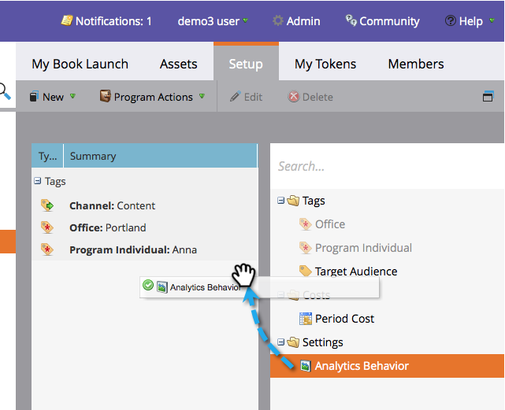

# 编辑分析行为设置 {#edit-analytics-behavior-settings}

您可以在渠道[&#128279;](/help/marketo/product-docs/reporting/revenue-cycle-analytics/program-analytics/make-a-program-without-a-period-cost-available-in-revenue-explorer-and-analyzers.md){target="_blank"}上的管理员级别设置分析行为，但也可以在项目级别对其进行编辑。 操作方法如下：

1. 前往 **[!UICONTROL Marketing Activities]**。

   

1. 查找并选择您的项目。

   

1. 在&#x200B;**[!UICONTROL Setup]**&#x200B;选项卡中，将[!UICONTROL Analytics Behavior]拖到画布上。

   

1. 选择所需的Analytics行为。

   

>[!NOTE]
>
>**定义**
>
>**[!UICONTROL Inclusive]** — 此选项将确保程序可用于在收入资源管理器和分析器中报告，无论您是否包括期间成本。
>
>**[!UICONTROL Operational]** — 此选项导致程序无法显示在收入资源管理器或分析器中。

>[!NOTE]
>
>默认行为（如果未应用此设置）是，仅当至少有一个期间成本（即使分配了零美元的期间成本）时，项目才会包含在Analytics中。

1. 单击 **[!UICONTROL Save]**。

   

已在项目级别覆盖分析行为。

>[!NOTE]
>
>这些更改将在第二天生效，该程序要么可用，要么从Revenue Explorer和分析器中退出。
