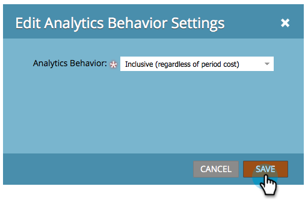

# 编辑分析行为设置{#edit-analytics-behavior-settings}

您可以在渠道](/help/marketo/product-docs/reporting/revenue-cycle-analytics/program-analytics/make-a-program-without-a-period-cost-available-in-revenue-explorer-and-analyzers.md)的管理级别设置[分析行为，但也可以在项目级别编辑它。 这是方法。

1. 转到&#x200B;**营销活动**。

   

1. 查找并选择您的项目。

   

1. 在“设置”选项卡下，将“分析行为”拖动到画布上。

   

1. 选择您需要的分析行为。

   

>[!NOTE]
>
>**定义**
>
>**包含** -此选项将确保项目可用于收入浏览器和分析器中的报告，而无论您是否已包括期间成本。
>
>**操作** -此选项导致项目不显示在收入浏览器或分析器中。

>[!NOTE]
>
>默认行为（如果未应用此设置）是仅当至少存在一个期间成本（即使分配了零美元）时，项目才会包含在Analytics DC中。

1. 单击&#x200B;**保存**。

   

干得好！ 现在您了解如何在项目级别覆盖分析行为。

>[!NOTE]
>
>更改将在第二天生效，项目将可用或从收入浏览器和分析器中提取。
