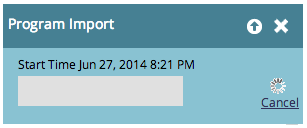

# 导入项目{#import-a-program}

项目可以从一个Marketo订阅导入到另一个。 例如，您可以在沙箱中创建项目，然后将其导入到实时订阅中。 此外，还可以从Marketo项目库导入预建项目。

## 导入项目{#import-a-program-1}

1. 转至&#x200B;**营销活动。**

   

1. 单击&#x200B;**新建**&#x200B;下拉列表。 选择&#x200B;**导入项目**。

   

   >[!NOTE]
   >
   >项目导入仅适用于启用了“导入项目”权限的角色的用户。 了解有关[管理用户角色和权限的更多信息](/help/marketo/product-docs/administration/users-and-roles/managing-user-roles-and-permissions.md)。
   >
   >要将沙箱帐户连接到您的实时订阅，请与[Marketo支持](https://nation.marketo.com/t5/Support/ct-p/Support)联系。

1. 选择Marketo **订阅**&#x200B;和要导入的项目。 单击&#x200B;**下一步**。

   

1. 为导入的活动指定&#x200B;**项目文件夹**。 单击&#x200B;**下一步。**

   

   >[!NOTE]
   >
   >确保已选择&#x200B;**使用默认冲突**&#x200B;规则。 将项目导入具有相同名称资源的实例时，需要冲突规则。

1. 预览详细信息和&#x200B;**导入**&#x200B;项目。

   

   对话框显示项目导入进度。

   

完成导入后，您将收到一封电子邮件确认。

>[!NOTE]
>
>您需要重新计划导入的批活动并激活触发活动。 系统会自动停用导入的活动计划并触发活动。

## 在Marketo项目库{#identify-pre-built-programs-in-the-marketo-program-library}中标识预建项目

Marketo项目库包含预建的、经过测试的项目，您可以将这些导入订阅。 可用项目包括：

1. **滴滴培养。** 发送一系列通过等待步骤分隔的电子邮件。
1. **数据管理。** 使用智能活动保持数据完整性。
1. **电子邮件和登陆页** 发送带有优惠（如“下载此白皮书”）的初始电子邮件。随后将显示确认或提醒电子邮件。 包含表单登陆页。
1. **具有进度状态的电子邮件。** 发送包含可跟踪链接的邮件爆炸，供用户单击。更新每个人的晋升状态 — 已发送、已打开、已单击等。
1. **有趣的时刻。** 为您的销售团队创造有趣的时刻，使其保持循环。
1. **登陆页自动响应程序。** 使用可下载的内容吸引新人并培养新人。包括登陆页和表单。
1. **生命周期2。** 使用评分将新人转变为符合营销资格的人。
1. **移动电子邮件模板。** 针对iPhone和Android测试的响应式电子邮件模板。Android、MS Outlook、Exchange和Gmail和Yahoo！等第三方应用程序的某些版本 邮件移动应用程序不支持响应式模板所需的CSS。 我们建议您在发送电子邮件之前先进行测试。
1. **项目导入抽奖。** 为试用项目库的人抽奖！只需批准电子邮件和登陆页并激活智能活动。 然后视图批准的登陆页，填写表单，您便已进入！
1. **销售可用活动。** 为销售代表提供了在CRM中从仪表板执行Marketo智能活动的方法。
1. **评分 — Spark Edition。** 在单个评分字段中捕获的人口统计和行为评分。包括20多个与评分相关的活动。
1. **评分 — 标准版和精选版。** 在不同的得分字段中捕获的人口统计和行为得分。包括20多个与评分相关的活动。
1. **将新人同步到CRM。** 将新人同步到您的CRM系统的活动。它会分配人员状态，以便被识别为不适合销售。
1. **带事件适配器的网络研讨会。** 一整套电子邮件（如邀请和提醒），以及包含表单和活动的登陆页，可让用户在项目中移动。此项目可获取有关注册、出席等的更新。 WebEx等在线事件提供商提供。
1. **无事件适配器的网络研讨会。** 与上面相同，但需要手动处理录制注册、出席等过程。
1. **天狼星的决策评分项目**。该项目旨在支持标准的Sirius决策评分模型，包括隐式和显式评分规则以及矩阵化人员分配。

>[!CAUTION]
>
>在导入“评分 — 标准版和选择版”项目之前，必须创建两个自定义字段（“人口统计得分”和“行为得分”）。

## 项目导入期间对外部资产的影响{#impact-on-external-assets-during-program-imports}

项目使用外部资产，如电子邮件模板、登陆页模板、图像、表单、令牌和项目标记。 您可以配置处理登陆页模板和项目标签的方式，Marketo可以自动管理其余内容。

**电子邮件模** 板：除非存在同名的模板，否则将自动导入和创建电子邮件模板。

**登陆页模板：** 登陆页模板导入设计工作室。可以使用冲突规则在存在同名模板时配置行为。 使用默认规则，如果存在同名的登陆页模板，则会在该模板中附加一个数字。 例如，如果存在一个名为“标准模板”的登陆页模板，则将创建名为“标准模板1”的模板。

**图像：** 除非存在同名图像，否则登陆页使用的图像会导入到设计工作室中。

**令牌：** 在导入过程中，位于项目外部的令牌将转换为本地令牌。

>[!CAUTION]
>
>图像类型我的令牌在项目导入中不受支持。 如果导入了具有图像类型的项目,**不会**&#x200B;令牌。

**项目标** 记：您可以使用冲突规则控制如何处理目标帐户中不存在的项目标记。使用默认规则将创建项目标记，或者您可以选择忽略这些标记。 **Forms:** 除非存在同名的外部表单，否则外部表单将自动导入设计工作室。

>[!CAUTION]
>
>导入项目时，将跳过包含[动态内容](/help/marketo/product-docs/personalization/segmentation-and-snippets/segmentation/understanding-dynamic-content.md)的登陆页/电子邮件。
