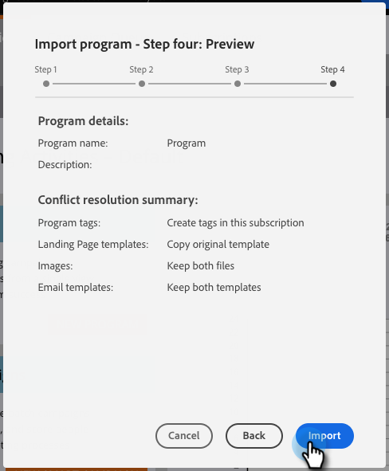

# 导入程序 {#import-a-program}

可以从一个Marketo订阅导入另一个程序。 例如，您可以在沙盒中创建项目，然后将其导入实时订阅。 此外，您还可以从Marketo项目库导入预建项目。

## 导入程序 {#importing-a-program}

1. 转到 **营销活动。**

   

1. 单击 **新建** 下拉。 选择 **导入程序**.

   

   >[!NOTE]
   >
   >只有启用了“导入程序”权限的角色的用户才能使用“程序导入”。 详细了解 [管理用户角色和权限](/help/marketo/product-docs/administration/users-and-roles/managing-user-roles-and-permissions.md).
   >
   >要将沙盒帐户连接到实时订阅，请联系 [Marketo支持](https://nation.marketo.com/t5/Support/ct-p/Support).

1. 选择Marketo **订阅** 和一个要导入的程序。 单击 **下一个**.

   

1. 指定 **Campaign文件夹** 对于导入的程序。 单击 **下一个。**

   

   >[!NOTE]
   >
   >确保 **使用默认冲突** 规则。 将程序导入具有相同名称资产的实例时，需要使用冲突规则。

1. 选择所需的冲突详细信息并单击 **下一个**.

   

   >[!NOTE]
   >
   >将使用自定义流程步骤或从流程步骤服务派生的智能列表规则的程序导入到包含多个兼容服务提供商的目标实例中，系统将提示导入用户将步骤或规则分配给目标实例中的正确服务提供商。

1. 预览详细信息和 **导入** 程序。

   

导入完成后，您将收到一封电子邮件确认。

>[!NOTE]
>
>您将需要重新计划导入的批量促销活动，并激活触发促销活动。 系统会自动停用导入项目中的促销活动计划并触发促销活动。

## 程序导入过程中对外部资产的影响 {#impact-on-external-assets-during-program-imports}

程序使用外部资产，如电子邮件模板、登陆页面模板、图像、表单、令牌和程序标记。 您能够配置处理登陆页面模板和项目群标记的方式，Marketo会自动管理其余内容。

**电子邮件/登陆页面模板：** 电子邮件/登陆页面模板将导入Design Studio。 您可以使用冲突规则配置存在同名模板时的行为。 使用默认规则时，如果模板中存在具有相同名称的数字，则会将该数字附加到模板中。 例如，如果您已经有一个名为“标准模板”的模板，则新模板将命名为“标准模板 — 1”。

**登陆页面/Forms:** 如果Design Studio中存在具有相同名称的表单或登陆页面，则仍会导入这些表单或登陆页面，但会在其名称后附加一个数字(例如：登陆页面 — 1)。

**图像：** 除非存在具有相同名称的图像，否则登陆页面使用的图像会导入设计工作室。

**令牌：** 在导入过程中，位于项目外的令牌将转换为本地令牌。

>[!CAUTION]
>
>映像类型的令牌在程序导入中不受支持。 如果导入的程序具有图像类型，则会 **否** 令牌将通过。

**程序标记：** 您可以使用冲突规则来控制如何处理目标帐户中不存在的程序标记。 使用默认规则将创建程序标记，或者您可以选择忽略标记。

>[!CAUTION]
>
>导入项目时，电子邮件/登陆页面中包含 [动态内容](/help/marketo/product-docs/personalization/segmentation-and-snippets/segmentation/understanding-dynamic-content.md) 将被跳过。
