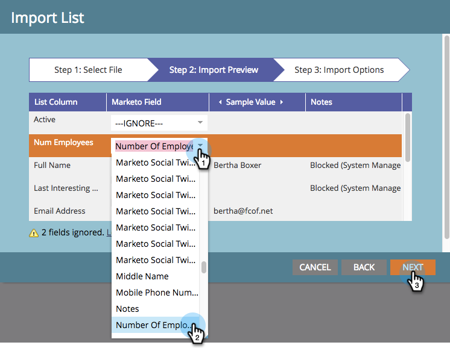

# 将电子表格中的成员导入程序 {#import-members-from-a-spreadsheet-into-a-program}

您可以导入自动成为项目群成员的人员列表。 该怎么做呢。

## 准备CSV文件 {#prepare-your-csv-file}

1. 在Excel中创建标准CSV文件，如下面的示例所示。

   

   >[!CAUTION]
   >
   >将日期导入日期字段时，请使用此格式：2013年9月29日（月/日/年）。

## 将CSV导入Marketo {#import-your-csv-into-marketo}

1. 在您的项目中，转到 **成员** 部分。

   

1. 单击 **导入成员**.

   

1. 选择CSV并单击 **下一个**.

   

1. 将列表中的数据值映射到其对应的Marketo字段，然后单击 **下一个**.

   

   >[!NOTE]
   >
   >如果有任何您不想导入的字段，请选择 **忽略** “Marketo字段”下拉菜单中。

1. 选择 **成员状态** 你的名单。

   

1. 单击 **导入**.

   

1. 等待Marketo完成导入，然后关闭确认对话框。

   

   太棒了！ 您应该会看到导入的新成员。

   

>[!MORELIKETHIS]
>
>[管理和查看成员](/help/marketo/product-docs/core-marketo-concepts/programs/working-with-programs/manage-and-view-members.md)
