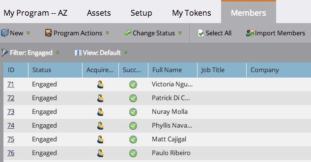

# 从电子表格导入成员到项目 {#import-members-from-a-spreadsheet-into-a-program}

您可以导入自动成为项目群成员的人员列表。 该怎么做呢。

## 准备CSV文件 {#prepare-your-csv-file}

1. 在[!DNL Excel]中创建标准CSV文件，如下面的示例所示。

   

   >[!CAUTION]
   >
   >将日期导入日期字段时，请使用此格式：9/29/24（月/日/年）。

## 将CSV导入Marketo {#import-your-csv-into-marketo}

1. 在您的项目中，转到&#x200B;**[!UICONTROL Members]**&#x200B;部分。

   

1. 单击 **[!UICONTROL Import Members]**。

   

1. 选择CSV并单击&#x200B;**[!UICONTROL Next]**。

   

1. 将列表中的数据值映射到其对应的Marketo字段，然后单击&#x200B;**[!UICONTROL Next]**。

   

   >[!NOTE]
   >
   >如果有任何您不想导入的字段，请在Marketo字段下拉菜单中选择&#x200B;**[!UICONTROL IGNORE]**。

1. 为您的列表选择&#x200B;**[!UICONTROL Member Status]**。

   

1. 单击 **[!UICONTROL Import]**。

   

1. 等待Marketo完成导入，然后关闭确认对话框。

   

   太棒了！ 您应该会看到导入的新成员。

   

>[!MORELIKETHIS]
>
>[管理和查看成员](/help/marketo/product-docs/core-marketo-concepts/programs/working-with-programs/manage-and-view-members.md){target="_blank"}
