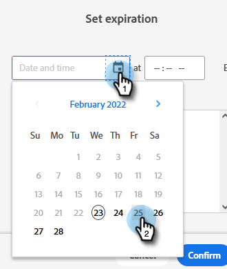
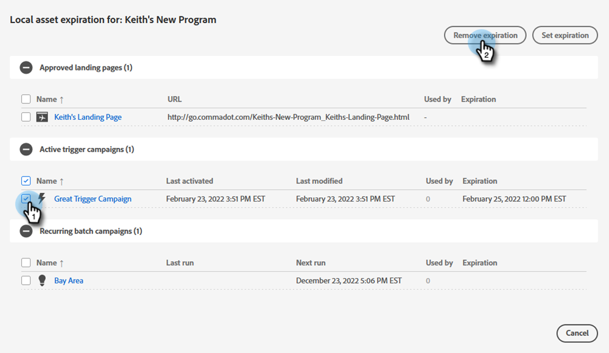

# 本地资产到期 {#local-asset-expiration}

设置过期日期/时间，以取消发布登陆页面、停用触发器营销活动或停止循环的批量营销活动。

## 授予计划资产过期权限 {#grant-schedule-asset-expiration-permission}

在安排资源到期之前，您的Marketo角色必须启用相应的权限。

>[!NOTE]
>
>**需要管理员权限**

1. 在 [!UICONTROL 管理员] 区域，单击 **[!UICONTROL 用户和角色]**.

   

1. 单击 **[!UICONTROL 角色]** 选项卡，选择要向其授予访问权限的用户，然后单击 **[!UICONTROL 编辑角色]**.

   

1. 下 [!UICONTROL 访问营销活动]，选择 **[!UICONTROL 计划本地资产过期]** 并单击 **[!UICONTROL 保存]**.

   

## 设置到期日期 {#set-an-expiration-date}

1. 右键单击所需的项目并选择 **[!UICONTROL 设置本地资源过期]**.

   

1. 选中要为其设置到期日期的资源，然后单击 **[!UICONTROL 设置过期]**.

   

1. 选择到期日期。

   

1. 设置时间。 您必须安排一个未来至少15分钟的时间（不要忘记输入上午/下午）。 单击 **[!UICONTROL 确认]** 完成时。

   

>[!NOTE]
>
>* 要编辑现有到期日期，只需选中资产并单击 **[!UICONTROL 设置过期]**.
>* 资产过期后，将不再显示在过期网格上。 网格将仅显示已发布的登陆页面、活动的触发器营销活动和循环的批量营销活动。
>* 如果将资产移动到其他项目，则将删除计划的过期时间。

## 删除到期日期 {#remove-an-expiration-date}

1. 要删除过期日期，请检查资产并单击 **[!UICONTROL 删除过期]**.

   

1. 查看受影响的资产，然后单击 **[!UICONTROL 确认]**.

   

>[!NOTE]
>
>不能删除未来15分钟内的过期日期。 要“删除”过期时间，您需要等待资产过期，然后重新批准或重新激活资产。
