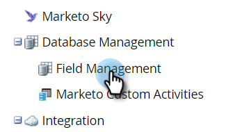

# 项目群成员自定义字段 {#program-member-custom-fields}

程序成员自定义字段允许您收集每个成员的特定于程序的数据。 它们可用于：Marketo表单、智能列表过滤器和触发器，以及智能营销活动流操作。 可在项目群的“成员”选项卡中查看数据。

## 创建项目群成员自定义字段 {#create-a-program-member-custom-field}

1. 在Marketo中，单击 **管理员**.

   

1. 单击 **字段管理**.

   

1. 单击 **新建自定义字段**.

   

1. 单击对象下拉列表并选择所需的对象。

   

   >[!NOTE]
   >
   >人员和项目群成员自定义字段不能共享相同的名称。

1. 填写其余字段，然后单击 **创建**.

   

   >[!NOTE]
   >
   >程序成员自定义字段支持的类型包括：布尔值、日期、日期时间、浮点数、整数、字符串、URL。 [了解有关字段类型的更多信息](/help/marketo/product-docs/administration/field-management/custom-field-type-glossary.md){target="_blank"}.

## 对象说明 {#object-descriptions}

| 对象 | 描述 |
|---|---|
| 公司 | 与人员关联的公司的名称。 |
| 机会 | 商机可以与个人或帐户关联，作为潜在的未来销售。 他们通常通过CRM或API进入Marketo。 |
| 人员 | 通过营销活动与之接触的Marketo数据库中的个人。 |
| 计划成员 | 同时还是项目群成员的人员 |

## 触发器和过滤器 {#triggers-and-filters}

您可以通过以下方式在智能列表中利用此程序特定的数据 [触发器](/help/marketo/product-docs/core-marketo-concepts/smart-campaigns/creating-a-smart-campaign/define-smart-list-for-smart-campaign-trigger.md){target="_blank"} and/or [filters](/help/marketo/product-docs/core-marketo-concepts/smart-lists-and-static-lists/creating-a-smart-list/find-and-add-filters-to-a-smart-list.md){target="_blank"}.

## 注意事项 {#things-to-know}

* 项目群成员自定义字段仅在本地资产中可用。 Design Studio不支持这些功能，因为无法将它绑定到特定程序。
* 不能将包含程序成员自定义字段的表单（或带有表单的登陆页面）克隆/移动到Design Studio。
* [您可以同步](/help/marketo/product-docs/core-marketo-concepts/programs/working-with-programs/program-member-custom-field-sync.md){target="_blank"} 项目群成员自定义字段和促销活动成员自定义字段。
* 程序成员对象最多可以有20个自定义字段。 这些字段适用于任何项目。
* 当您删除某个项目的成员时，如果他们的项目群成员自定义字段中包含任何数据，则将从该字段中清除该数据。
* 要查看数据，请单击程序中的成员选项卡，然后创建包含这些字段的自定义视图。
* 通过以下方式导入和导出 [列表](/help/marketo/getting-started/quick-wins/import-a-list-of-people.md){target="_blank"} and [API](https://developers.marketo.com/){target="_blank"} 受支持。 导出仅对项目群成员列表有效，对静态列表无效。
* 合并两个人员时，将使用入选者的项目群成员自定义字段数据。 但是，如果获胜方没有赢家，将使用失败方的价值。
* 项目群成员信息字段不允许更改类型。
* 程序成员自定义字段不支持“包含”智能列表约束。

>[!MORELIKETHIS]
>
>* [在Marketo中创建自定义字段](/help/marketo/product-docs/administration/field-management/create-a-custom-field-in-marketo.md){target="_blank"}
>
>* [程序成员自定义字段同步](/help/marketo/product-docs/core-marketo-concepts/programs/working-with-programs/program-member-custom-field-sync.md){target="_blank"}
