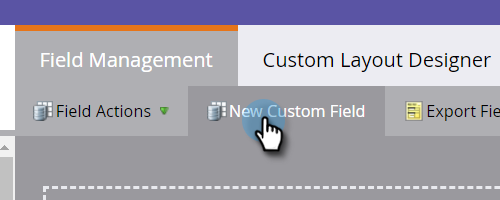

# 项目成员自定义字段 {#program-member-custom-fields}

项目成员自定义字段允许您为每个成员收集项目特定数据。 它们可用于：Marketo表单、智能列表过滤器和触发器以及智能活动流动操作。 数据可在项目的成员选项卡中查看。

## 创建项目成员自定义字段 {#create-a-program-member-custom-field}

1. 在Marketo中，单击“管 **理员**”。

   

1. 单击 **字段管理**。

   

1. 单击“ **新建自定义字段**”。

   

1. 单击“对象”(Object)下拉框，然后选择所需的对象。

   

   >[!NOTE]
   >
   >人员和项目成员自定义字段不能共享相同的名称。

1. 填写其余字段，然后单击“ **创建**”。

   

   >[!NOTE]
   >
   >项目成员自定义字段支持的类型有：boolean、date、datetime、float、integer、string、URL。 [了解有关字段类型的更多信息](http://docs.marketo.com/x/Wwgt)。

## 对象描述 {#object-descriptions}

| 对象 | 说明 |
|---|---|
| 公司 | 与人员关联的公司的名称。 |
| 机会 | 作为潜在的未来销售，机会可以与个人或帐户相关联。 他们通常通过CRM或API进入Marketo。 |
| 人物 | 您正通过营销活动与Marketo数据库中的个人进行互动。 |
| 项目成员 | 也是项目成员的人 |

## 触发器和过滤器 {#triggers-and-filters}

您可以通过触发器和／或项目在智能列表中 利用此过滤器特 [定数据](http://docs.marketo.com/x/2YAI)。

## 要知道的事 {#things-to-know}

* 项目成员自定义字段仅在本地资产中可用。 Design Studio中不支持它们，因为无法将其绑定到特定项目。
* 不能将包含登陆页成员自定义字段的表单(或具有表单的项目)克隆／移动到Design Studio。
* 项目成员自定义字段不能用作令牌。
* 项目成员对象最多可包含20个自定义字段。 这些字段可供任何项目使用。
* 当您删除项目的成员时，如果其项目成员自定义字段中有任何数据，则将从该字段中删除数据。
* 要视图数据，请单击项目中的“成员”选项卡，并创建包含这些字段的自定义视图。
* 支持通过列表 API 导入和导出。
* 合并两个人时，将使用入选方的项目会员自定义字段数据。 但如果赢家没有，那么输家的价值将被利用。

>[!MORELIKETHIS]
>
>[在Marketo中创建自定义字段](../../../../product-docs/administration/field-management/create-a-custom-field-in-marketo.md)

