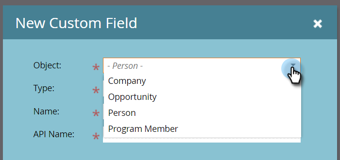

# 程序成员自定义字段 {#program-member-custom-fields}

利用项目成员自定义字段，可收集每个成员的项目特定数据。 它们可用于：Marketo表单、智能列表过滤器和触发器，以及智能营销活动流程操作。 可在程序的“成员”(Members)选项卡中查看数据。

>[!NOTE]
>
>目前，项目成员自定义字段没有与Salesforce Campaign成员字段集成。

## 创建程序成员自定义字段 {#create-a-program-member-custom-field}

1. 在Marketo中，单击 **管理员**.

   

1. 单击 **字段管理**.

   

1. 单击 **新建自定义字段**.

   

1. 单击“对象”(Object)下拉列表，然后选择所需的对象。

   

   >[!NOTE]
   >
   >人员和项目群成员自定义字段不能共享相同的名称。

1. 填写剩余字段并单击 **创建**.

   

   >[!NOTE]
   >
   >程序成员自定义字段支持的类型包括：布尔值、日期、日期时间、浮点、整数、字符串、URL。 [了解有关字段类型的更多信息](/help/marketo/product-docs/administration/field-management/custom-field-type-glossary.md).

## 对象描述 {#object-descriptions}

| 对象 | 描述 |
|---|---|
| 公司 | 与人员关联的公司名称。 |
| 机会 | 一个机会可以与一个人或帐户关联，作为潜在的未来销售。 他们通常通过CRM或API进入Marketo。 |
| 人员 | 您通过营销活动参与的Marketo数据库中的个人。 |
| 计划成员 | 也是项目成员的人 |

## 触发器和过滤器 {#triggers-and-filters}

您可以通过 [触发器](/help/marketo/product-docs/core-marketo-concepts/smart-campaigns/creating-a-smart-campaign/define-smart-list-for-smart-campaign-trigger.md) 和/或 [过滤器](/help/marketo/product-docs/core-marketo-concepts/smart-lists-and-static-lists/creating-a-smart-list/find-and-add-filters-to-a-smart-list.md).

## 注意事项 {#things-to-know}

* 项目成员自定义字段仅在本地资产中可用。 Design Studio不支持这些功能，因为无法将其绑定到特定的程序。
* 不能将包含程序成员自定义字段的表单（或包含表单的登陆页面）克隆/移动到Design Studio。
* 程序成员对象最多可以有20个自定义字段。 这些字段可用于任何程序。
* 删除某个程序的成员时，如果其“程序成员”(Program Member)自定义字段中有任何数据，则会从该字段中清除该数据。
* 要查看数据，请单击程序中的“成员”选项卡，并创建包含该字段的自定义视图。
* 通过导入和导出 [列表](/help/marketo/getting-started/quick-wins/import-a-list-of-people.md) 和 [API](https://developers.marketo.com/) 。 导出仅适用于程序成员列表，而不适用于静态列表。
* 当您合并两个人时，将使用入选者的项目成员自定义字段数据。 但如果获胜者没有，则将使用失败者的价值。
* 更改类型为 **not** 在“项目成员信息”(Program Member Info)字段中允许。

>[!MORELIKETHIS]
>
>[在Marketo中创建自定义字段](/help/marketo/product-docs/administration/field-management/create-a-custom-field-in-marketo.md)
