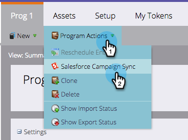

# 将SFDC活动与项目同步 {#sync-an-sfdc-campaign-with-a-program}

Marketo允许您将项目与Salesforce活动同步，以在两个系统中保持相同的列表，包括人员的状态。 开始吧！

>[!PREREQUISITES]
>
>您首先需要启 [用Salesforce活动同步](../../../../product-docs/crm-sync/salesforce-sync/setup/optional-steps/enable-disable-campaign-sync.md) 。

>[!CAUTION]
>
>当SFDC活动与Marketo项目同步时，对于项目的子活动，将禁用默示的SFDC操作(例如，添加到SFDC活动，同步到SFDC)。

1. 转到营 **销活动**。

   

1. 选择项目。

   

1. 单击 **项目**&#x200B;操作 **，然后选择** Salesforce活动同步。

   

1. 选择**新建**或选择现有Salesforce活动。

   >[!TIP]
   >
   >如果您选择了现有的Salesforce活动，请确 [保匹配Salesforce活动和Marketo项目的项目状态](../../../../product-docs/crm-sync/salesforce-sync/sfdc-sync-details/sfdc-errors/how-to-match-program-statuses-and-salesforce-campaign-statuses-prior-to-sync.md)。

1. 输入新活动的名称，然后单击“保 **存”**。

   

1. 现在，您可以在活动摘要页面中验证项目同步详细信息。

   

   太棒了！ 现在，Marketo中的任何项目状态更改都会同步到SFDC活动，反之亦然。

