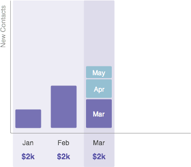

# 了解期间成本 {#understanding-period-costs}

## 概述 {#overview}

期间成本指您在特定月份花在项目上的钱。

>[!NOTE]
>
>**示例**
>
>如果您花1000美元为7月启动的[!DNL eBook]聘请插图师 — [!DNL eBook]项目在7月的时间成本为1000美元。
>
>如果您每月在[!DNL Google Adwords]上花费$200 - [!DNL Google Adwords]计划的期间成本为每月&#x200B;_200 $3}。_

>[!NOTE]
>
>[了解程序](/help/marketo/product-docs/core-marketo-concepts/programs/creating-programs/understanding-programs.md)
>
>[了解计划成员资格](/help/marketo/product-docs/core-marketo-concepts/programs/creating-programs/understanding-program-membership.md)

## 期间成本的计算方式 {#how-period-costs-are-calculated}

想象一下3月份发生的事件，比如网络研讨会。 新员工于一月及二月透过广告预先获得。 活动后，当人们在4月和5月下载网络研讨会时，也会获得新联系人。

1. 单个期间成本归因于3月……

   

   ...之前和之后几个月添加的联系人将&#x200B;_仅_&#x200B;计为3月份。

   

1. 期间成本归于一月、二月及三月……

   

   ...仅在3月之后几个月内添加的联系人将计为3月。

   

1. 期间成本归于一月及四月……

   

   ...1月到3月新增的联系人将计为1月。 4月和5月新增的联系人将计为4月。

   

   >[!NOTE]
   >
   >总之，没有定义期间成本的月份将“后退”到定义的最后一个期间。 如果没有前期成本，则月份将“前转”到已定义的下一个月份。 如果尚未为&#x200B;_任何_&#x200B;个月定义期间成本，则程序将无法使用RCE报告。

   >[!MORELIKETHIS]
   >
   >* [在计划中使用期间成本](/help/marketo/product-docs/core-marketo-concepts/programs/working-with-programs/using-period-costs-in-a-program.md)
   >* [按期间成本筛选项目报告](/help/marketo/product-docs/core-marketo-concepts/programs/program-performance-report/filter-a-program-report-by-period-cost.md)
