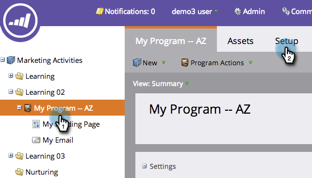

# 在项目中使用标记 {#use-tags-in-a-program}

标记是描述程序的属性，用于在报表中对程序类型进行分组。

>[!NOTE]
>
>如果您使用收入周期浏览器，则必须定义期间成本（即使它为0），以便报表可用于该程序。

## 在项目中使用标记 {#use-a-tag-in-a-program}

1. 选择您的项目。 单击 **设置**.

   

1. 将标记拖放到画布上。

   

1. 从下拉列表中选择一个值。

   

1. 单击&#x200B;**保存**。

   

1. 好极了。 您将在画布中看到新标记。

   

## 编辑标记 {#edit-a-tag}

1. 转到 **设置** 选项卡。 右键单击标记。 选择 **编辑**.

   

1. 单击下拉列表。 选择新值。

   

1. 单击&#x200B;**保存**。

   

1. 太棒了！ 您应该会看到所做的编辑反映在画布中。

   

## 删除标记  {#delete-a-tag}

1. 转到 **设置** 选项卡。 右键单击标记并选择 **删除**.

   

1. 单击 **删除** 以确认。

   

做得不错！具有一致标记的程序可让您在运行报表时更轻松。
