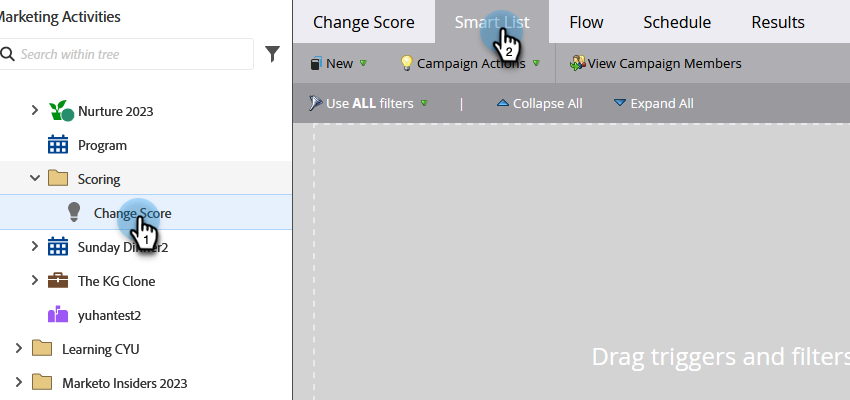

# 为Smart Campaign定义智能列表 | 批次 {#define-smart-list-for-smart-campaign-batch}

智能列表是整个Marketo Engage中用于定义“人员”（哪些人员）的机制，包括报表、列表或智能营销活动。 以下是如何为批处理营销活动定义智能列表。

>[!CAUTION]
>
>对活动营销活动进行智能列表或流程步骤编辑可能会破坏其功能。 如果您选择这么做，请谨慎操作。

1. 选择智能营销活动，然后单击&#x200B;**[!UICONTROL 智能列表]**。

   

1. 键入以搜索过滤器，并将其拖放到画布上。 对多个筛选器重复执行上述操作。

   

   >[!NOTE]
   >
   >仅包含筛选器的智能营销活动在&#x200B;_批处理_&#x200B;模式下运行。 它会在数据库中找到根据过滤器符合条件的人员，并一次性在流中运行所有这些人员。

   >[!NOTE]
   >
   >您可以通过添加触发器使Smart Campaign处于&#x200B;_触发器_&#x200B;模式，根据实时事件逐人运行Smart Campaign。

1. 单击下拉列表，并为所选的过滤器选择过滤器运算符。

   

   >[!CAUTION]
   >
   >红色曲线表示错误或缺少信息。 如果未更正，则营销活动将无效且不会运行。

1. 输入筛选值。

   

   >[!NOTE]
   >
   >默认情况下，满足所有智能列表规则的用户是符合条件的。 您可以根据营销策划需求对此进行修改。 请查看复杂逻辑的[智能列表规则](/help/marketo/product-docs/core-marketo-concepts/smart-lists-and-static-lists/using-smart-lists/using-advanced-smart-list-rule-logic.md){target="_blank"}以了解更多信息。

   要在实时事件中一次触发一个人，了解如何[为Smart Campaign定义智能列表 | 触发器](/help/marketo/product-docs/core-marketo-concepts/smart-campaigns/creating-a-smart-campaign/define-smart-list-for-smart-campaign-trigger.md){target="_blank"}。

   >[!MORELIKETHIS]
   >
   >* [为智能营销活动定义智能列表 | 触发器](/help/marketo/product-docs/core-marketo-concepts/smart-campaigns/creating-a-smart-campaign/define-smart-list-for-smart-campaign-trigger.md){target="_blank"}
   >* [向智能营销活动添加流程步骤](/help/marketo/product-docs/core-marketo-concepts/smart-campaigns/flow-actions/add-a-flow-step-to-a-smart-campaign.md){target="_blank"}
