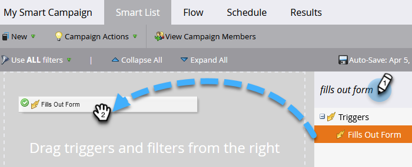
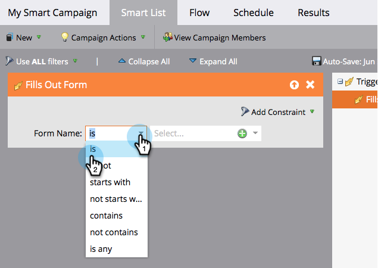

# 为智能营销活动定义智能列表 |触发器 {#define-smart-list-for-smart-campaign-trigger}

通过添加触发器，根据实时事件，使智能营销活动一次在一个人上运行。

1. 在您的智能营销活动中，单击 **智能列表** 选项卡。

   

1. 搜索所需的触发器，并将其拖放到画布中。

   

   >[!NOTE]
   >
   >具有触发器的智能营销活动在 **触发器** 模式。 它根据触发的事件和任何其他过滤器一次只在一个人上运行。

   >[!IMPORTANT]
   >
   >在触发器促销活动智能列表中使用布尔字段时，必须将其明确设置为“false”，以便该字段在执行促销活动期间正确评估。

1. 单击下拉列表，然后选择运算符。

   

   >[!CAUTION]
   >
   >红色的曲线表示错误或缺少信息。 如果未更正，则营销活动将无效，且不会运行。

   >[!TIP]
   >
   >在同时具有触发器和过滤器的智能营销活动中，触发器将位于顶部，触发时，只有满足过滤器标准的用户才会进入流程。

1. 定义触发器。

   

   >[!NOTE]
   >
   >使用多个触发器时，如果 **任意** 其中一个触发器将被激活。

要同时针对一组人员运行营销活动，请了解如何 [为智能营销活动定义智能列表 |批](/help/marketo/product-docs/core-marketo-concepts/smart-campaigns/creating-a-smart-campaign/define-smart-list-for-smart-campaign-batch.md).

>[!MORELIKETHIS]
>
>[向智能营销活动添加流量步骤](/help/marketo/product-docs/core-marketo-concepts/smart-campaigns/flow-actions/add-a-flow-step-to-a-smart-campaign.md)
